# Hexcrawler Development Log

A running record of how the project evolves: what changed, why, and the route we
took to get there. There is one entry per commit, newest at the bottom. Images live in
`docs/devlog/<date>-<slug>/`. We keep the version we settled on plus a few
rejected ones, so the log shows how each decision was reached.

## Before this log (Jan - Sep 2026)

The log starts at commit ~255. By then Hexcrawler was a React 19 + TypeScript
D&D 5e hexcrawl with:
- canvas rendering for the overworld, interiors and combat
- eight domain reducers
- behaviour-tree enemy AI
- procedural caves, dungeons, ruins, towers and towns
- an SRD monster database for CR 1/8-5
- Barbarian as the reference class implementation

Git history covers the details before this point.

---

## 2026-09-25: Terrain texture overhaul, exploration

**What:** a standalone preview harness (`texture-previews/`) that renders the
current `HexTextureGenerator` next to four replacement art directions. The
previews use the same sample map, plus real layouts from the game's interior
generators.

**Why:** the current textures have several structural problems:
- Each terrain is a single 32-40px repeating tile anchored to the canvas origin,
  so decorations get sliced at hex edges.
- Water has no shoreline, and rivers are just blue hexes.
- Interiors, towns and combat maps fall back to flat colours.

**Route:**
1. Bundled the live generator with esbuild so the baseline is pixel-exact, not
   a reimplementation.
2. Built four candidates, each drawn per hex with world-space noise, river
   channels that connect across hex edges, and neighbour-aware coastlines:
   - A. Painted Relief: per-pixel hillshade
   - B. Ink & Parchment Atlas
   - C. 16-bit Pixel Art: ordered dithering and lit sprites
   - D. Tabletop Tiles: flat vector
3. Picked C for a deeper pass. Extended it to interiors with per-POI themes
   (dungeon, cave, ruins, tower, town) and a 3/4 wall-face trick. Added torch
   and mushroom lighting quantised to 4 levels.
4. Rejected along the way:
   - The first dungeon pass: floor and wall tops were too close in tone to tell
     rooms apart. Fixed with dark wall tops, bright brick faces and warmer floors.
   - A river wobble strong enough to fold the distance field. It produced a
     smeared ink wedge at the banks.

| Current (baseline) | A. Painted Relief |
| --- | --- |
| 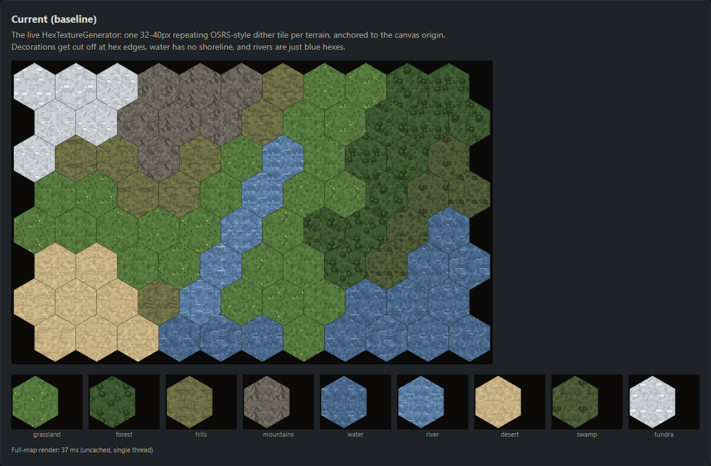 | 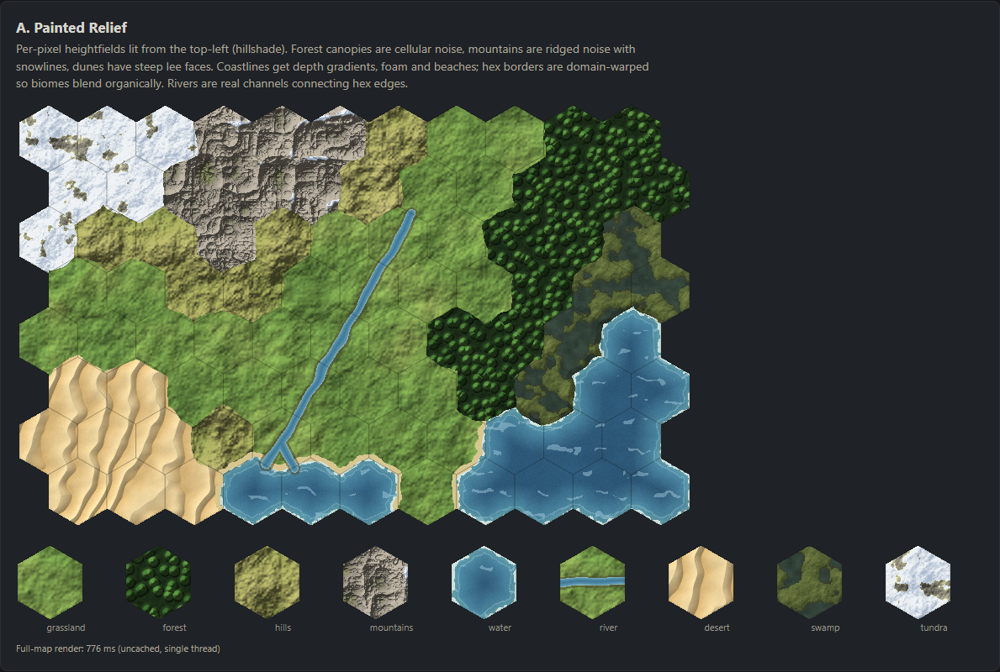 |
| **B. Ink & Parchment Atlas** | **D. Tabletop Tiles** |
| 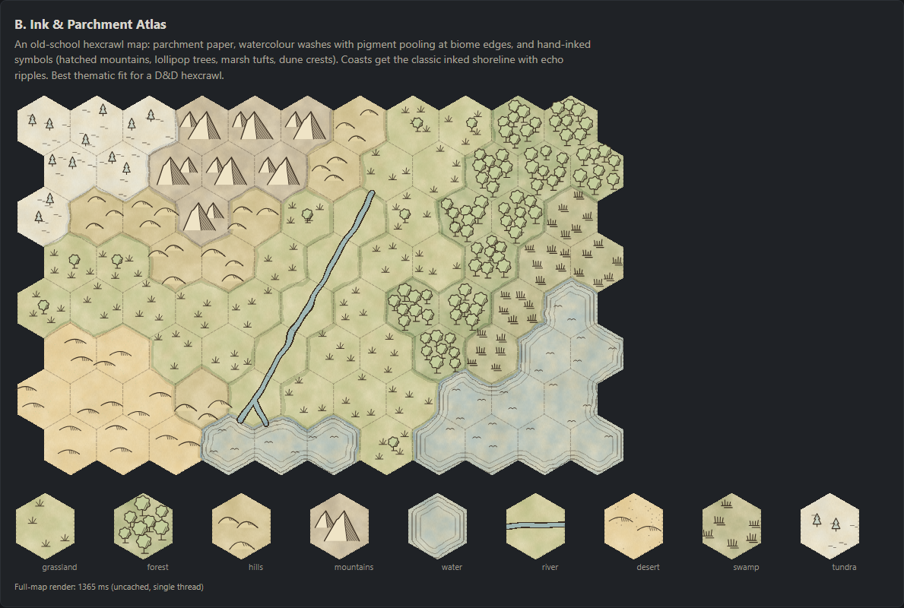 | 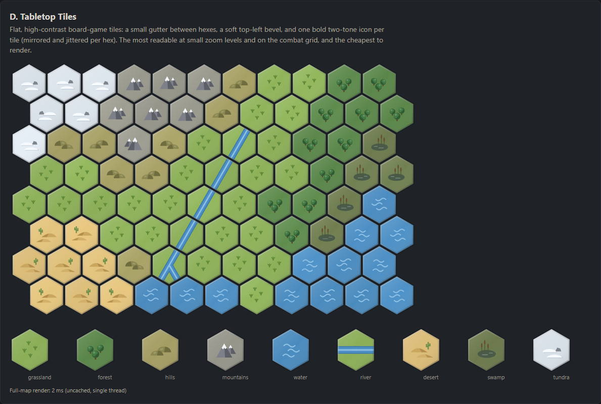 |

**Front-runner: C. 16-bit Pixel Art**

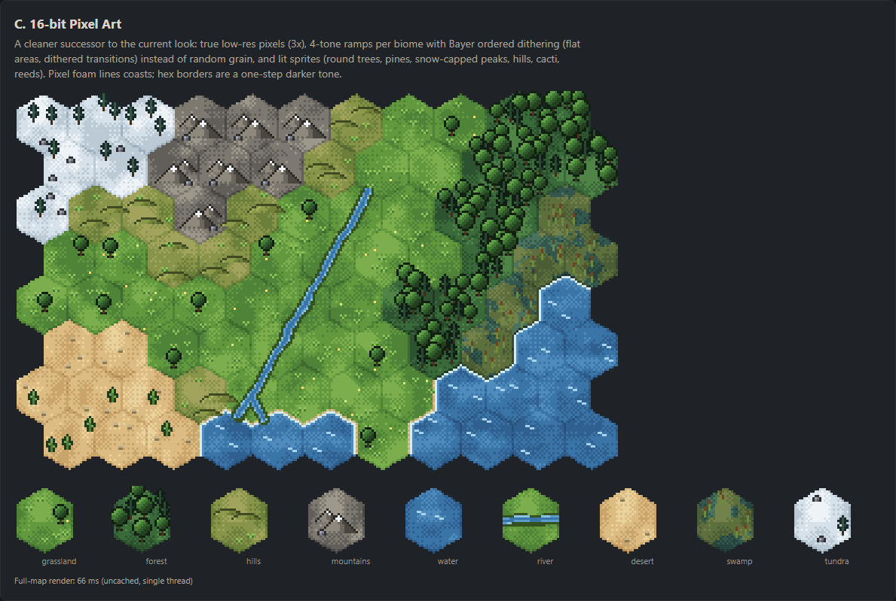

| Dungeon | Cave |
| --- | --- |
| 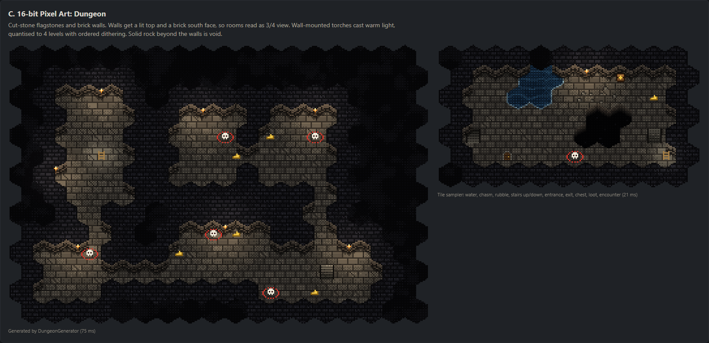 | 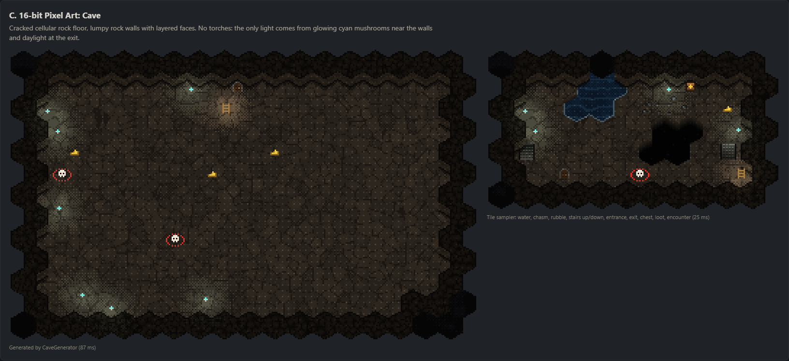 |
| **Ruins** | **Tower** |
| 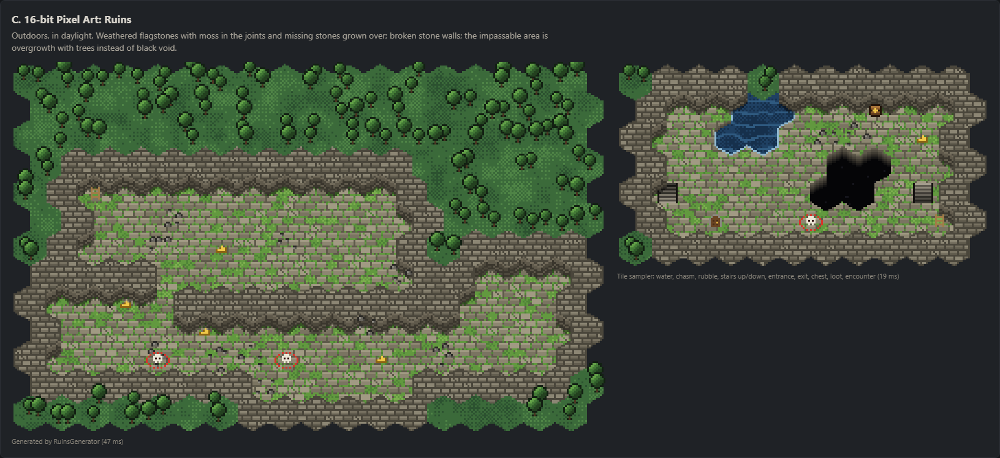 | 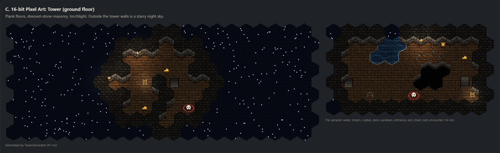 |

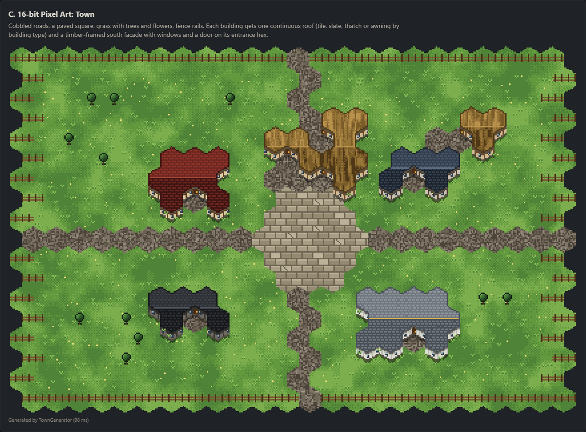

**Open:** final style choice, then port into `src/utils/hexTextureGenerator.ts`.
Interiors will need an offscreen canvas per floor because wall faces depend on
neighbouring hexes. Once the style is final, trim the rejected images here to a
representative few.

## 2026-09-25: Port the pixel-art style to the overworld

**What:** new `src/utils/pixelTerrainRenderer.ts`, a TypeScript port of style C from
`texture-previews/`. `HexGridCanvas` now uses it in place of `HexTextureGenerator`.
Interiors and combat still use the old generator.

**Why:** the overworld didn't look like the preview. Style C had only ever lived in the
preview harness and was never wired into the game.

**Route:**
- Each hex is rendered once at art resolution into two cached canvases: ground (clipped
  to the hex) and sprites. The whole visible map's ground is drawn first, then sprites in
  y order, so trees and peaks can overhang neighbouring hexes without getting clipped.
  The cache is rebuilt when `mapData` changes.
- The art grid is aligned to world coordinates and noise is sampled in world space.
  Coast foam, hex borders and river channels look up neighbouring terrain from the map,
  so they join up across hex edges just as in the preview.
- Rejected: pre-rendering the whole 60x60 map into one offscreen canvas. That's roughly
  1.5M art pixels to render up front, and fog of war would still need drawing on top.
- `ART_PX = 2`: the preview used 3px art pixels at hex radius 40, and the game uses radius
  30. 2px keeps about the same number of art pixels per hex, so sprite density matches.
  A fractional scale would make pixel widths uneven.
- Known leak: coast foam on an explored hex shows that the unexplored hex next to it is
  water.

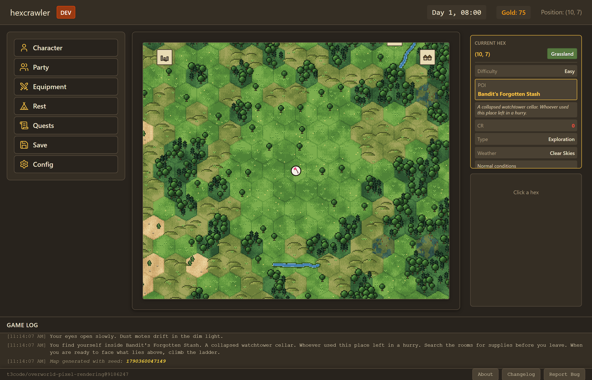

## 2026-09-25: Pixel-art player and map icons

**What:** new `src/utils/pixelIcons.ts` holds every map icon as ASCII pixel art:
- a player sprite for each of the 12 classes (outfit colours plus a class item: sword,
  staff, bow, lute, ...)
- all 11 POI types, plus `Cache`, which had no icon before
- the discovered-POI star
- the interior markers: door, ladder, stairs, chests, hazards, and enemy/boss/defeated tokens

The overworld and the interior canvas both use them. `poiRenderer.ts`, the shared
emoji `drawPlayerMarker`, and the three copies of `CLASS_ICONS` are gone.
`InteriorHexCanvas` now takes `playerClass` instead of an emoji.

**Why:** the vector and emoji icons clashed with the new pixel terrain.

**Route:**
- Sprites are strings with a shared palette. The dark outline is generated
  automatically. The player gets a second pale ring so it stays visible on any terrain,
  and unopened chests get a gold ring in place of the old blurred glow. Each sprite is
  baked once to a canvas and drawn at `ART_PX`, snapped to the terrain's art grid.
- The player is built from parts (head variant + body + items), so 12 classes need
  12 short kit entries instead of 12 hand-drawn sprites.
- Rejected on the first pass: white stair arrows were too faint and a village of
  two 3px huts was hard to read. The arrows are now gold and larger, and the huts bigger.
- Interior floors still use the old texture generator. Only the markers changed.

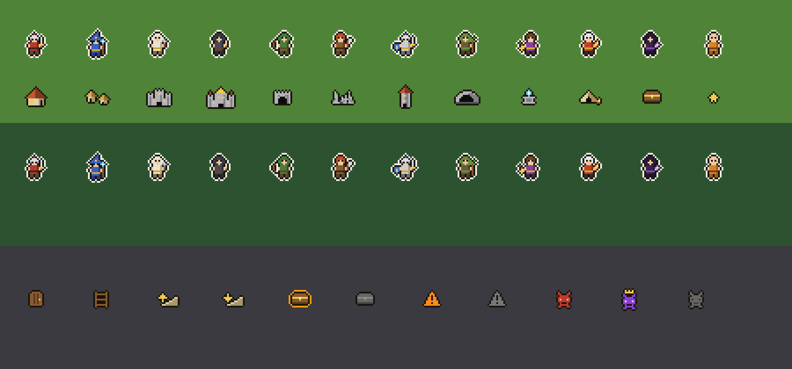

| Overworld | Interior |
| --- | --- |
| 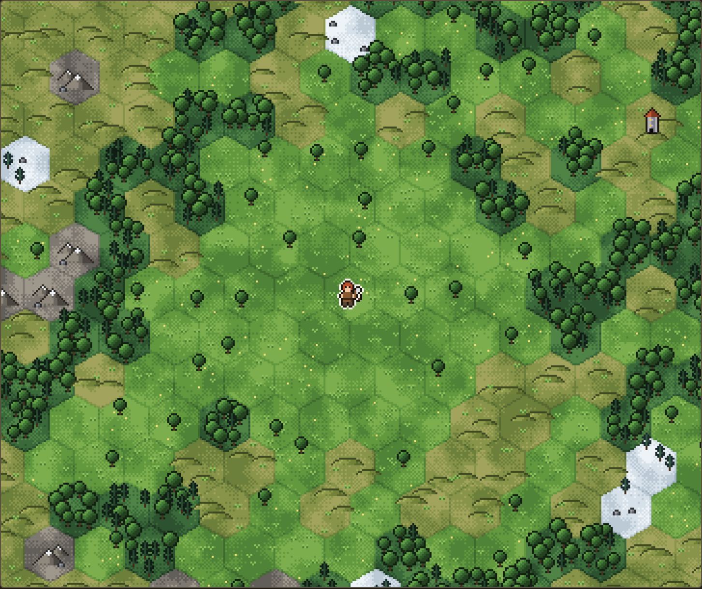 | 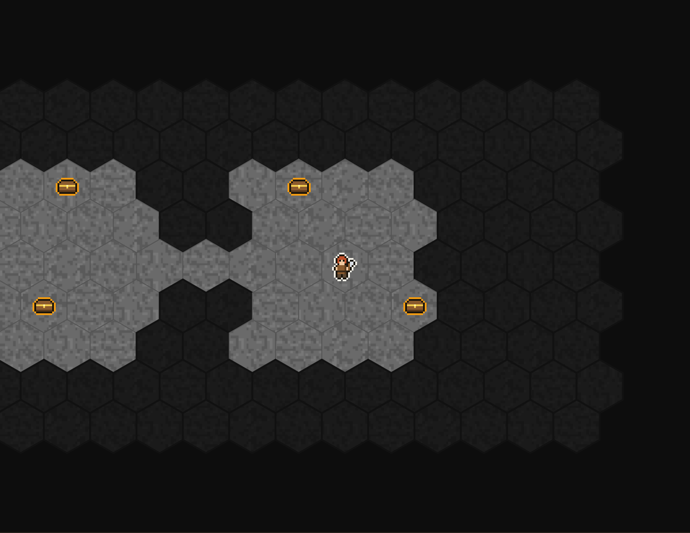 |

## 2026-09-25: Pixel art for interiors, combat and outlines

**What:** everything left on the old look now uses the pixel style.
- **Interior floors:** `utils/pixelInteriorRenderer.ts` ports the preview's interior
  renderer. It has five themes picked from the map's `poiType`: dungeon, cave, ruins,
  tower and town (camp/village/town). The 3/4 wall faces, building roofs and facades, and
  the torch and mushroom lighting are included. Each floor renders once into a single canvas.
- **Combat:** `utils/pixelBattlefieldRenderer.ts` bakes each battlefield into one canvas.
  Overworld-terrain fights get pixel ground tiles. POI fights (dungeon, cave, ruins, ...)
  get the matching interior theme, and their wall obstacles become real walls with faces.
  Trees, boulders, reeds, ice and dunes are sprites. Difficult terrain is a yellow dither.
  The centre landmark is the old vector art rasterised at art resolution with hard alpha.
  Allies are drawn with their class sprite and enemies with the monster sprite, plus a
  pixel ring under whoever's turn it is and a chunky HP bar.
- **Outlines and overlays:** selection, hover and attack outlines, plus the
  movement-range fill, now follow each hex's stepped art-pixel edge (`hexRenderer`).
  Overworld fog is drawn the same way, so it meets explored ground with no seam.
- **Removed:** `HexTextureGenerator` has no callers left and is deleted, along with all
  the vector obstacle and class-icon drawing in `CombatCanvas` (about 550 lines).

**Why:** the user approved the icons and asked to convert everything that was still in
the old style.

**Route:**
- Interiors render a whole floor at once, not per hex. Wall faces depend on the tiles to
  the north and lights reach across tiles, so per-hex tiles would need neighbour-aware
  cache keys anyway.
- Combat on overworld terrain uses ground tiles only. The overworld's forest sprites on
  every hex would bury the tokens. River fights use grass ground, because all-river hexes
  would turn into a maze of channels.
- Battlefield keys arrive as display names (`Forest`), so they're lowercased. Anything
  that isn't a POI type falls back to overworld terrain. The first pass routed `Forest`
  to the dungeon theme.
- The first obstacle pass was too small to read as blocked, so the sprites were doubled.
- `ART_PX` moved into `hexRenderer` so the outline code can use it without a circular import.

| Interior | Combat |
| --- | --- |
| 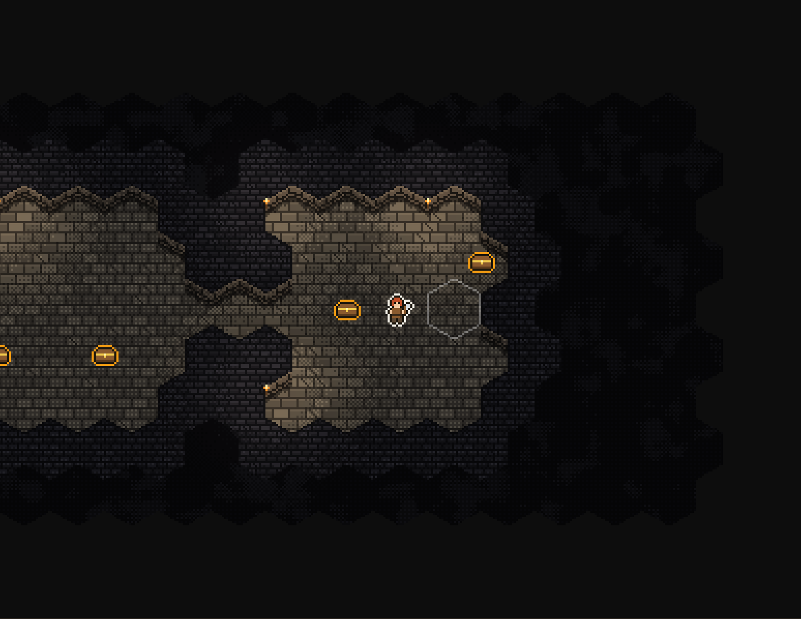 | 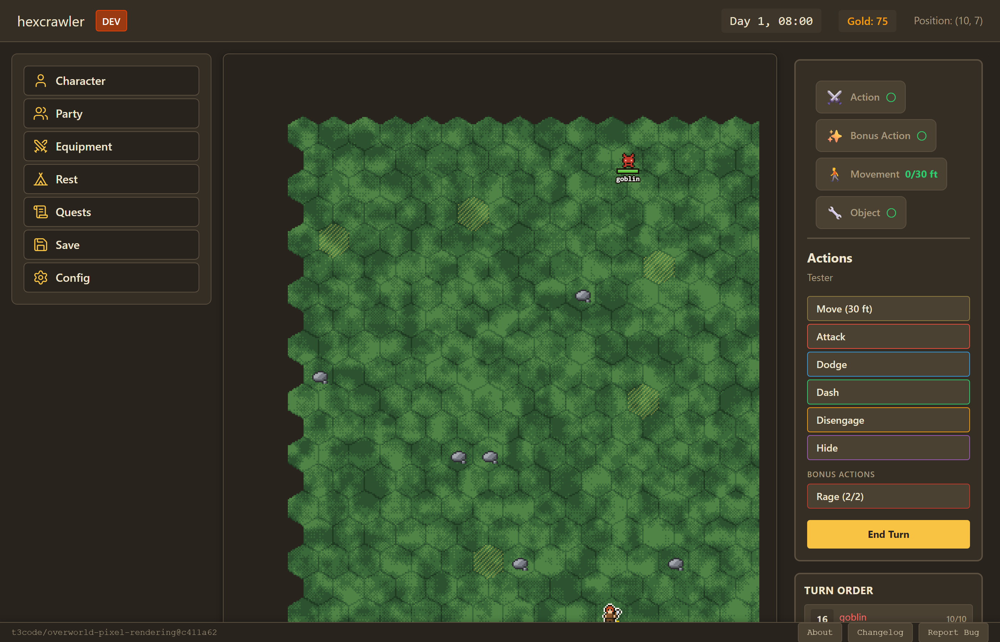 |

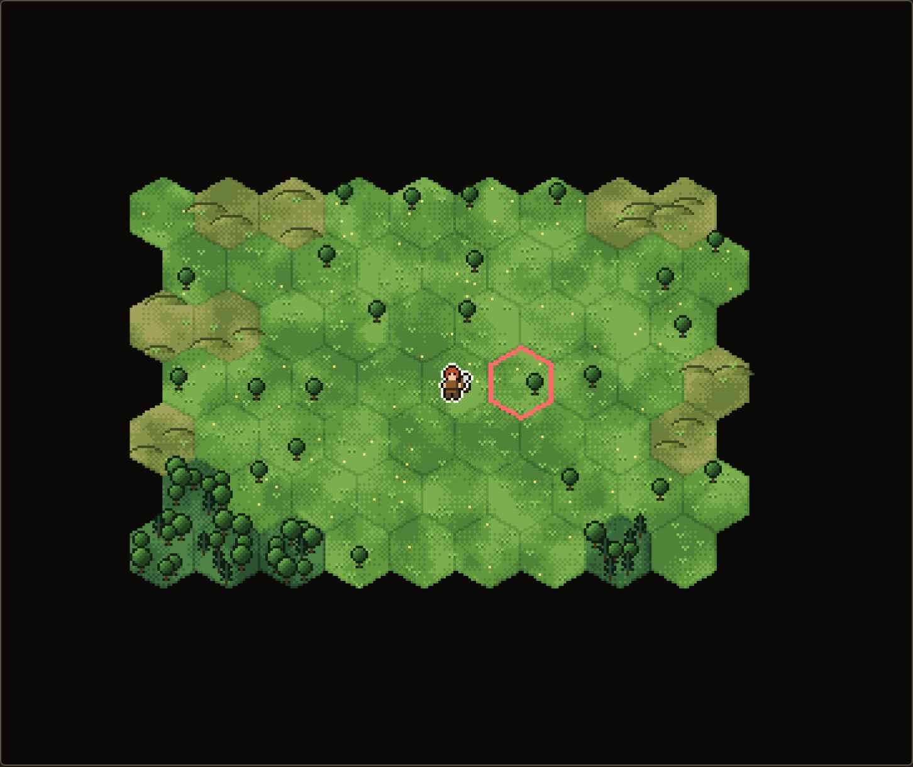

Battlefields shown at 1 CSS px per art px (dungeon, cave, ruins, town, desert, swamp):

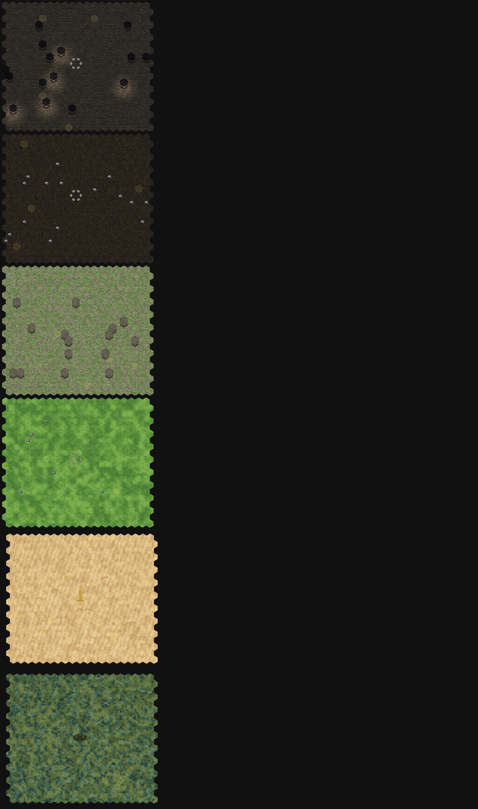

## 2026-09-25: Pixel icons in the HTML UI

**What:** a `<PixelIcon name>` component (`components/ui/PixelIcon.tsx`) shows any
sprite from `utils/pixelIcons` as a pixelated ``. `pixelIconImage` bakes the sprite to
a data URL. It gets 11 new UI sprites: action, bonus, move, object, lock, coins, gift,
bolt, disk, pin and bulb. They replace the emoji in:
- the combat action-economy bar
- the opportunity-attack prompt
- the exploration "Find the Exit Hex" lock
- the treasure-chest heading
- quest rewards
- save slot titles and locations
- the save-version tip

**Why:** the user pointed out that the Action / Bonus Action / Movement tracker was
still emoji next to the pixel-art map.

**Route:** the UI reuses the canvas sprite pipeline (ASCII art, auto outline, one bake
per sprite) instead of separate image files, so HTML and canvas icons look identical.
Typographic marks (✓ ○ ⚠ ✕ ♂/♀) and the dev-only DevTools panel keep their characters.

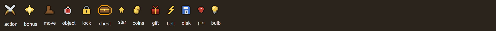

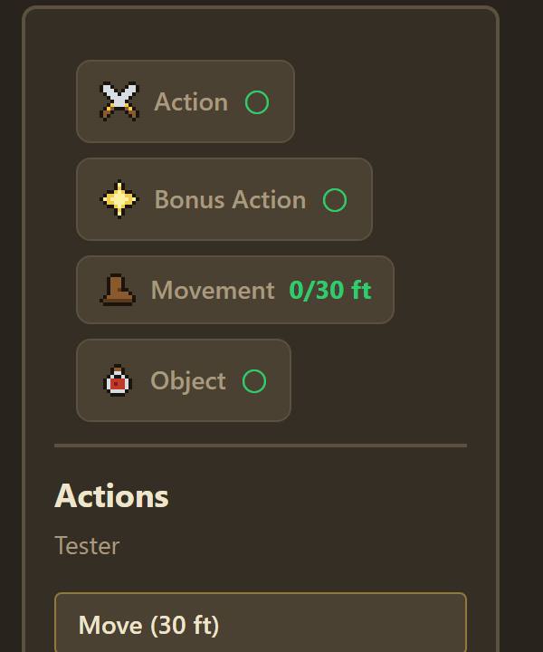

## 2026-09-25: Every remaining symbol is a pixel sprite

**What:** all the remaining icon glyphs in the UI are now `<PixelIcon>` sprites, using
new art added to `pixelIcons`:
- the overworld sidebar menu, which used lucide icons: character, party, equipment,
  tent, forage, scroll, disk, gear
- the character-creation class picker, which now shows each class's actual player
  sprite. `ClassIcon.tsx` and its SVGs are deleted.
- every close button (✕ ×) and the shadcn dialog's X
- ✓ checks, the ○ "available" dot, ⚠ warnings, ← exit/leave buttons, ▼▲▶ toggles,
  ♂/♀ in the party list and ⏱️ playtime
- the ■ legend chips in the town, now bordered CSS swatches
- the DevTools emoji

`lucide-react` had no users left and is uninstalled. The log hints that quoted
"← Exit ..." now just say "Exit ...", matching the buttons.

**Why:** the user asked for all symbols and emoji to be sprites after the combat bar.

**Route:** punctuation inside prose stays as text: • separators, × in "10×10", ≤, and →
in log messages. It reads as typography, not icons. Prettier reformatted all of
`ErrorBoundary` and most of `DevTools`, so those two were re-applied by hand to keep the
diff to the icon changes. The sidebar sprites were bumped to 3x after they looked tiny
next to the 22px lucide icons they replaced.

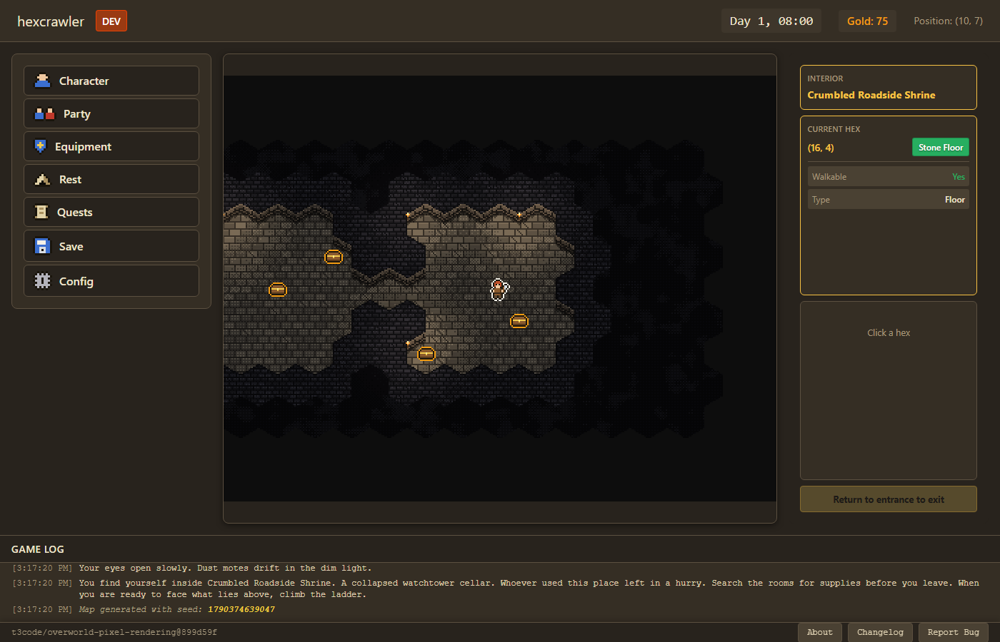

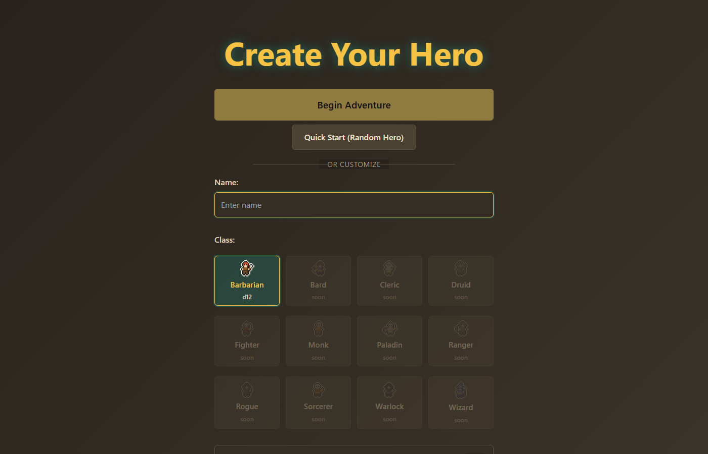

## 2026-09-25: Auto-merge PRs when CI passes

**What:** Added an `auto-merge` job to `.github/workflows/qa-tests.yml`. On a
same-repo PR it merges with a merge commit and deletes the branch, but only after
`checks` (typecheck, lint, unit) and both `qa-tests` browsers succeed.

**Why:** For now, a green CI run is enough review to land a PR.

**Route:** The test workflow already existed, so this is one new job, not a new
workflow. It depends on `checks` and `qa-tests` directly rather than on
`qa-summary`, because `qa-summary` runs with `if: always()` and reports success
when `qa-tests` is skipped. Merging directly in the job avoids needing GitHub's
repo-level auto-merge setting. Fork PRs are skipped because their token is read-only.

## 2026-09-25: Town redesign + milestone-1 review

**What:** Settlements are rebuilt from the grid up.
- `TownGenerator` is rewritten street-first. A two-hex avenue runs north from a two-hex gate.
  East–west streets cross it every 4 rows (street, 2 building rows, 1 yard row). The street
  nearest the middle gets a plaza with a well (a campfire in camps) and the quest board.
  Buildings sit in lots on the north side of each street with 1-hex alleys between them, so
  neighbours never merge. Each has a walkable doorstep on the street below its door.
- Landmarks (inn, shop, temple, blacksmith, market, barracks) are carved first from the frontage
  nearest the plaza, so they always exist. Houses fill what's left. Buildings get seeded names
  ("The Gilded Tankard").
- Map heights are now 4n + 2 per size (`SETTLEMENT_DIMENSIONS`) so streets fill the map.
- The renderer draws each building as one rectangle inscribed in its footprint. It has a gabled
  roof, a timbered or stone facade, windows, and a door above the doorstep. Per-type details: inn
  sign and lit windows, shop awning, forge glow and chimney, temple spire, barracks banners,
  market stall, wagon wheels, tents. The well, quest board and campfire are sprites. Fences are
  connected split rails, and cities get stone walls. City and metropolis no longer fall through
  to the dark dungeon theme.
- Gameplay fixes:
  - The gate exits every settlement type, not only `town`.
  - The inn option shows in any settlement.
  - Every settlement gets an Enter button (camps had none).
  - Every doorstep responds with a line naming the building.
  - The player spawns inside the gate instead of on it.
- Dead `TownScene` is removed. The settlement type list lives in one place (`isSettlement`).
- `docs/design/MILESTONE_1_REVIEW.md` is a top-down review of what blocks the first win
  condition: a quest from the first board to kill a level-5 boss.

**Why:** The user said towns "seem odd" and asked for a bottom-up redesign, plus a review against
the level-5-boss milestone.

**Route:** Rendered every settlement size through the live generator and renderer first (below).
The oddness came from the old approach:
- Rectangles in offset coordinates became ragged hex blobs.
- The door tile was cut out of the footprint, leaving a notch.
- Same-type neighbours merged into one roof, and houses sat on roads.
- Vertical roads zigzagged, the side fences were disconnected stubs, and the "secondary roads"
  mostly didn't connect.

Tried keeping per-hex roofs and just cleaning up placement. Rejected, because a hex-union roof
always reads as a blob. Drawing one inscribed rectangle per building, with a separate doorstep,
fixed the shapes outright.

South-facing doors only: the 3/4 view shows south faces, so buildings sit north of their street.

The first pass kept only the middle streets. That left the southern third as empty lawn and gave
the temple (4 wide) no lot. Switched to using every street, and to carving landmarks before
splitting house lots. A unit test checks for all sizes × 8 seeds that the entrance can reach
every door and the gate, and that the landmarks exist.

Before:

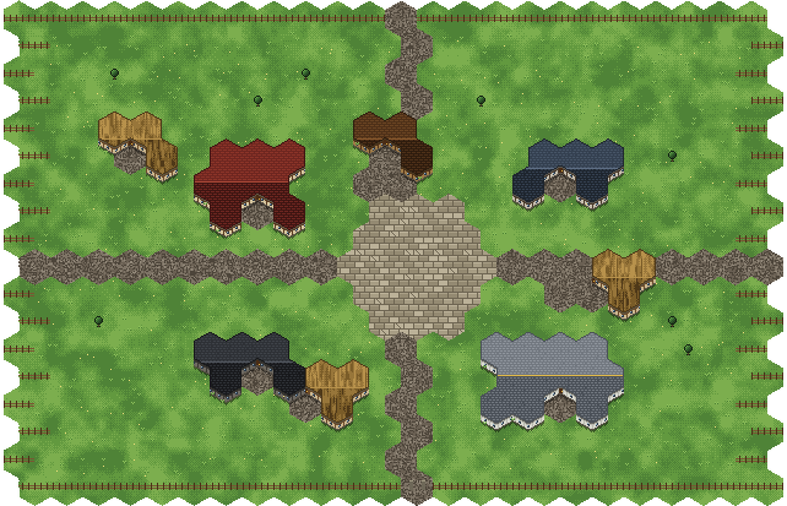
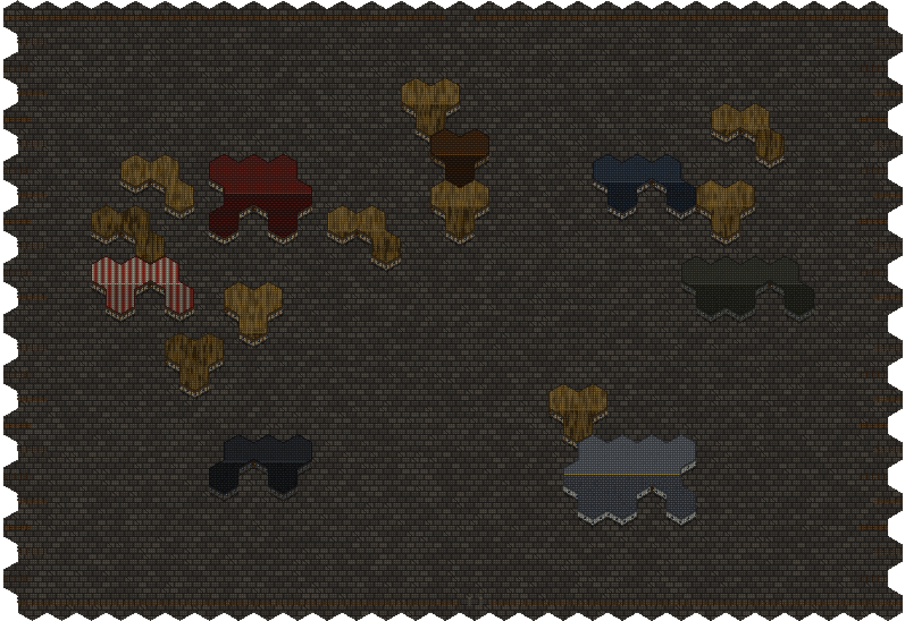

After:

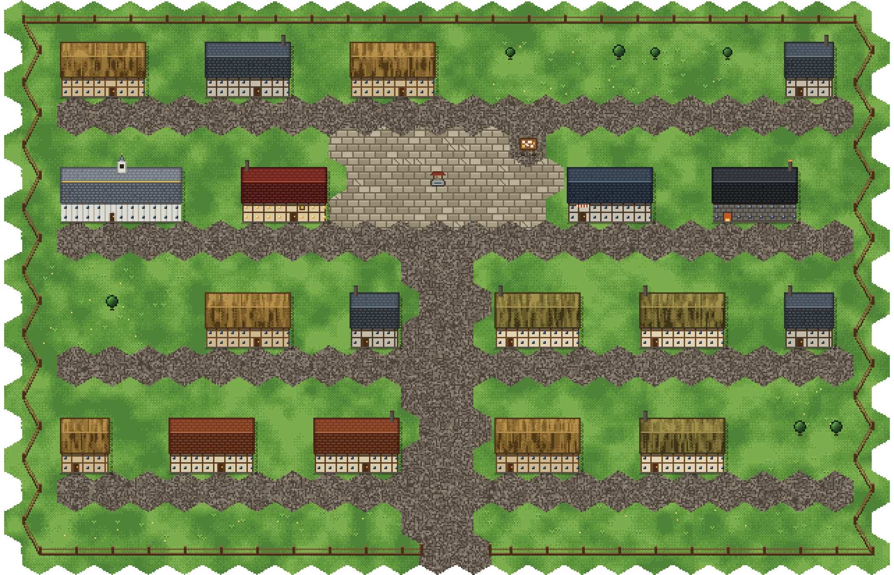
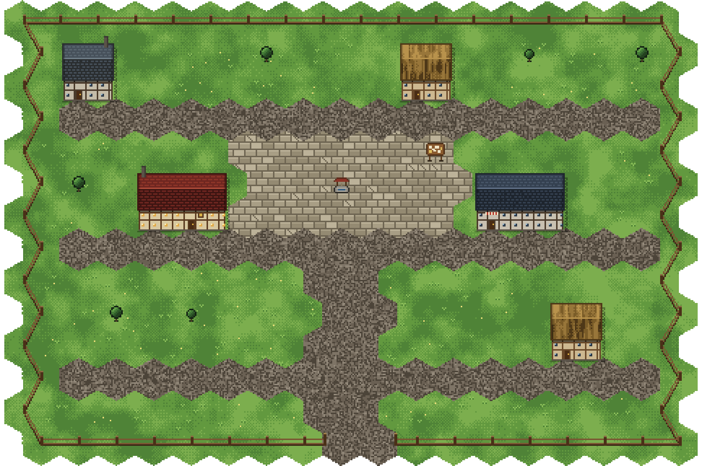
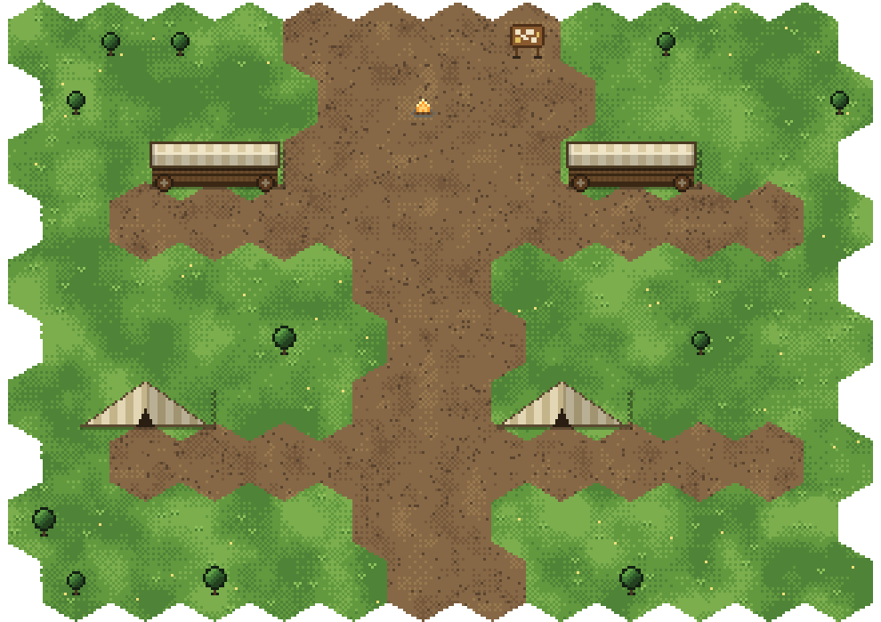
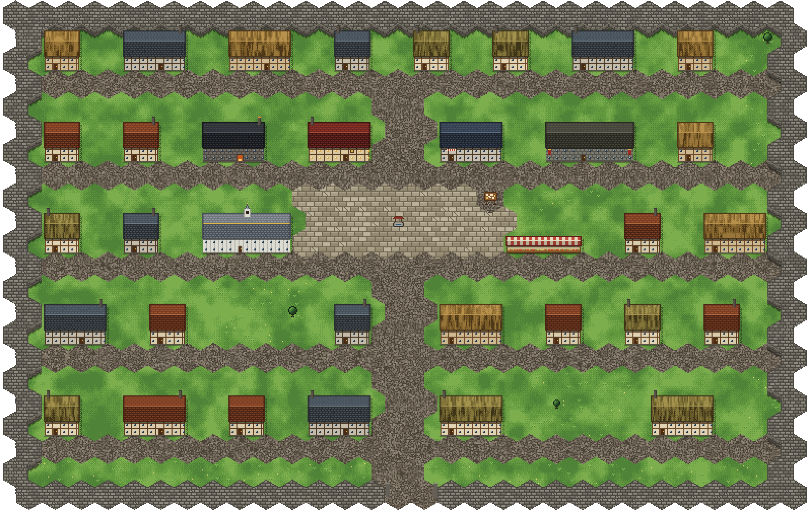
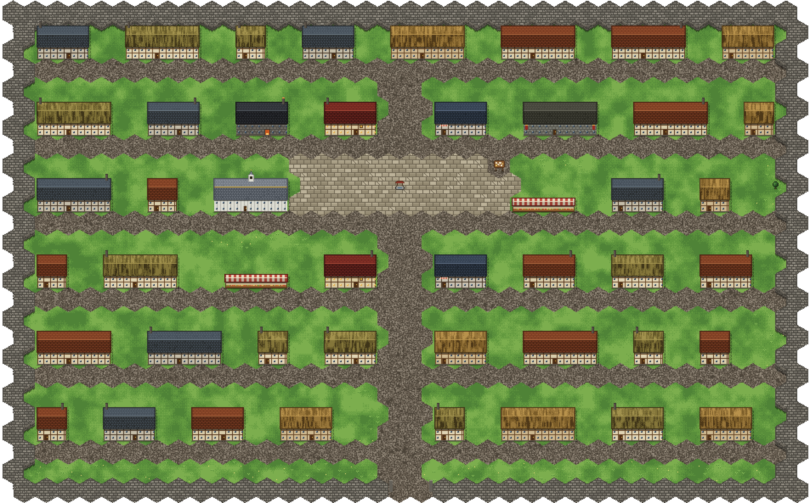

In game, the inn doorstep opening the rest panel with the inn option:

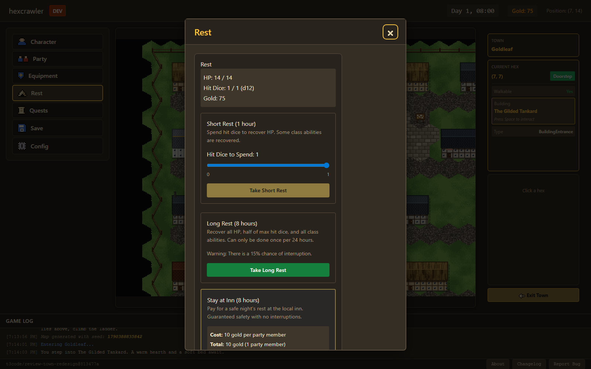
