# Hexcrawler Development Log

A running record of how the project evolves: what changed, why, and the route we
took to get there. There is one entry per commit, newest at the bottom. Images live in
`docs/devlog/<date>-<slug>/`. We keep the version we settled on plus a few
rejected ones, so the log shows how each decision was reached.

## Before this log (Jan - Sep 2026)

The log starts at commit ~255. By then Hexcrawler was a React 19 + TypeScript
D&D 5e hexcrawl with:
- canvas rendering for the overworld, interiors and combat
- eight domain reducers
- behaviour-tree enemy AI
- procedural caves, dungeons, ruins, towers and towns
- an SRD monster database for CR 1/8-5
- Barbarian as the reference class implementation

Git history covers the details before this point.

---

## 2026-09-25: Terrain texture overhaul, exploration

**What:** a standalone preview harness (`texture-previews/`) that renders the
current `HexTextureGenerator` next to four replacement art directions. The
previews use the same sample map, plus real layouts from the game's interior
generators.

**Why:** the current textures have several structural problems:
- Each terrain is a single 32-40px repeating tile anchored to the canvas origin,
  so decorations get sliced at hex edges.
- Water has no shoreline, and rivers are just blue hexes.
- Interiors, towns and combat maps fall back to flat colours.

**Route:**
1. Bundled the live generator with esbuild so the baseline is pixel-exact, not
   a reimplementation.
2. Built four candidates, each drawn per hex with world-space noise, river
   channels that connect across hex edges, and neighbour-aware coastlines:
   - A. Painted Relief: per-pixel hillshade
   - B. Ink & Parchment Atlas
   - C. 16-bit Pixel Art: ordered dithering and lit sprites
   - D. Tabletop Tiles: flat vector
3. Picked C for a deeper pass. Extended it to interiors with per-POI themes
   (dungeon, cave, ruins, tower, town) and a 3/4 wall-face trick. Added torch
   and mushroom lighting quantised to 4 levels.
4. Rejected along the way:
   - The first dungeon pass: floor and wall tops were too close in tone to tell
     rooms apart. Fixed with dark wall tops, bright brick faces and warmer floors.
   - A river wobble strong enough to fold the distance field. It produced a
     smeared ink wedge at the banks.

| Current (baseline) | A. Painted Relief |
| --- | --- |
| 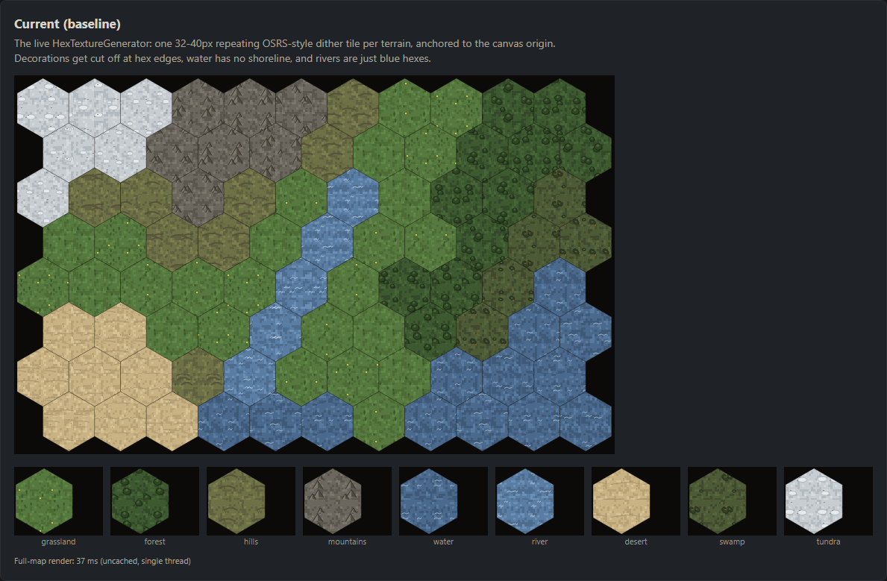 | 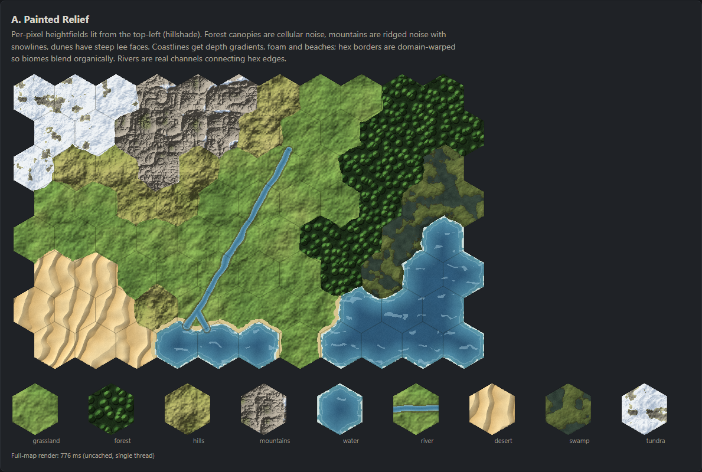 |
| **B. Ink & Parchment Atlas** | **D. Tabletop Tiles** |
| 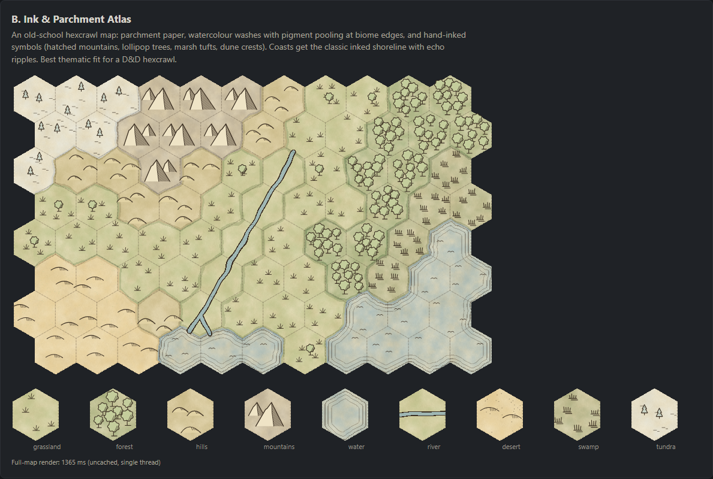 | 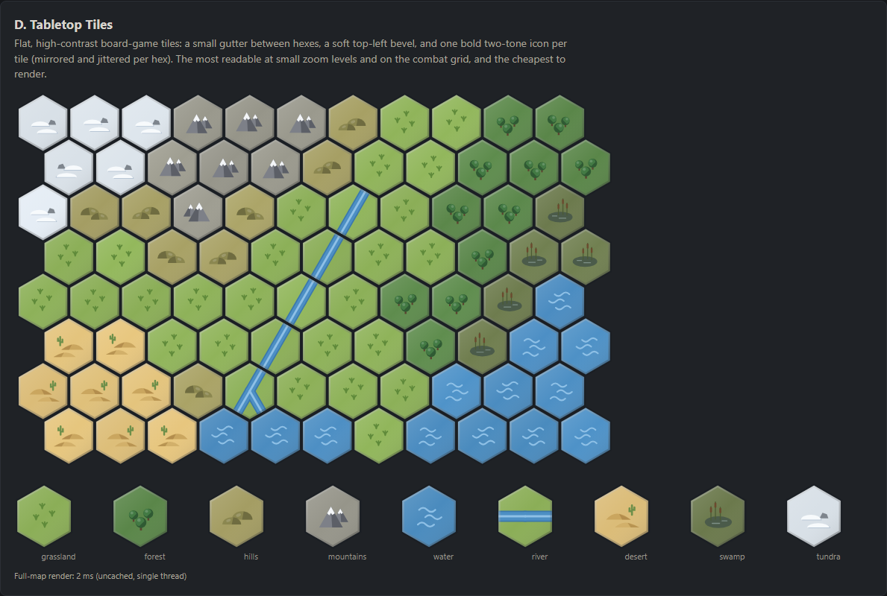 |

**Front-runner: C. 16-bit Pixel Art**

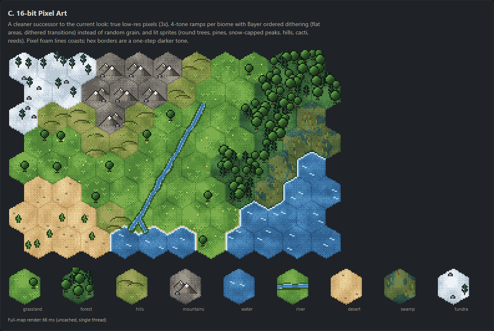

| Dungeon | Cave |
| --- | --- |
| 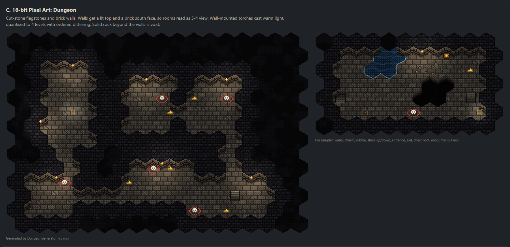 | 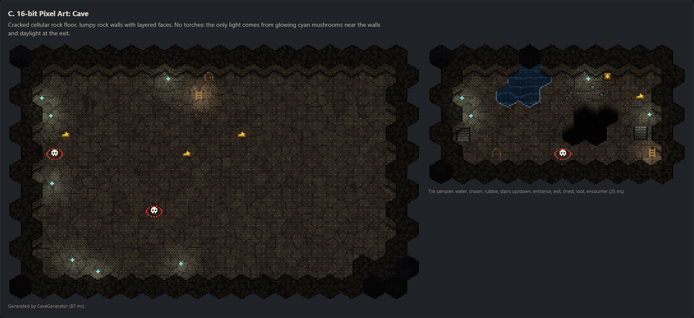 |
| **Ruins** | **Tower** |
| 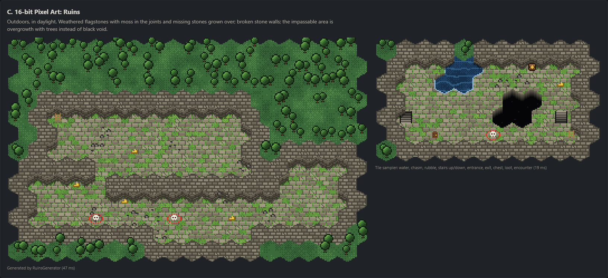 | 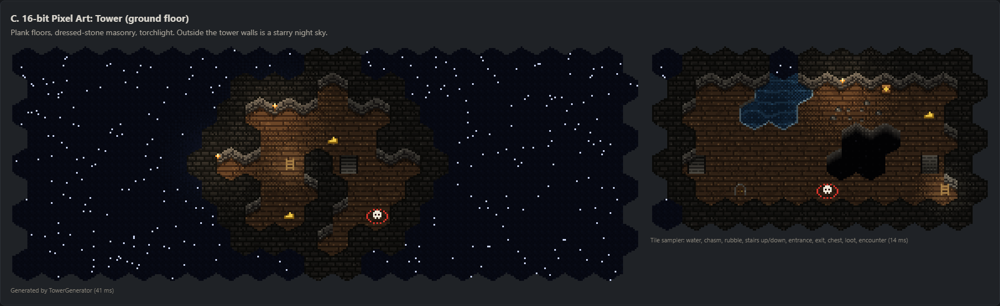 |

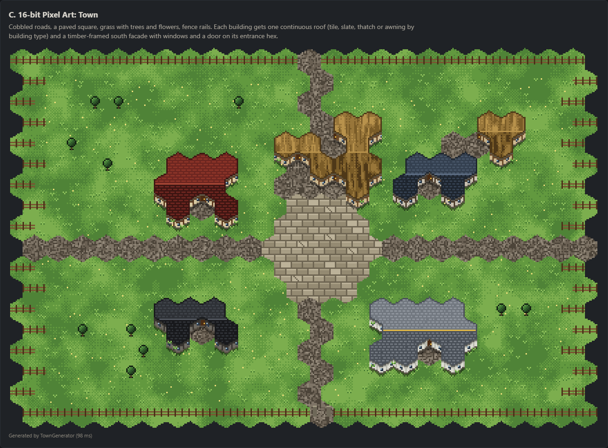

**Open:** final style choice, then port into `src/utils/hexTextureGenerator.ts`.
Interiors will need an offscreen canvas per floor because wall faces depend on
neighbouring hexes. Once the style is final, trim the rejected images here to a
representative few.

## 2026-09-25: Port the pixel-art style to the overworld

**What:** new `src/utils/pixelTerrainRenderer.ts`, a TypeScript port of style C from
`texture-previews/`. `HexGridCanvas` now uses it in place of `HexTextureGenerator`.
Interiors and combat still use the old generator.

**Why:** the overworld didn't look like the preview. Style C had only ever lived in the
preview harness and was never wired into the game.

**Route:**
- Each hex is rendered once at art resolution into two cached canvases: ground (clipped
  to the hex) and sprites. The whole visible map's ground is drawn first, then sprites in
  y order, so trees and peaks can overhang neighbouring hexes without getting clipped.
  The cache is rebuilt when `mapData` changes.
- The art grid is aligned to world coordinates and noise is sampled in world space.
  Coast foam, hex borders and river channels look up neighbouring terrain from the map,
  so they join up across hex edges just as in the preview.
- Rejected: pre-rendering the whole 60x60 map into one offscreen canvas. That's roughly
  1.5M art pixels to render up front, and fog of war would still need drawing on top.
- `ART_PX = 2`: the preview used 3px art pixels at hex radius 40, and the game uses radius
  30. 2px keeps about the same number of art pixels per hex, so sprite density matches.
  A fractional scale would make pixel widths uneven.
- Known leak: coast foam on an explored hex shows that the unexplored hex next to it is
  water.

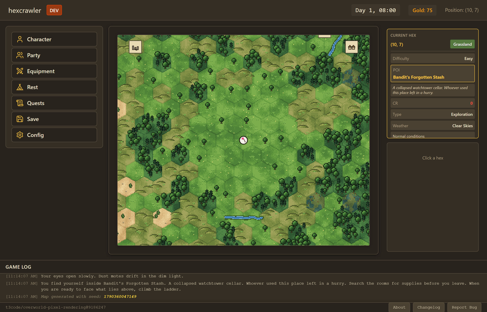

## 2026-09-25: Pixel-art player and map icons

**What:** new `src/utils/pixelIcons.ts` holds every map icon as ASCII pixel art:
- a player sprite for each of the 12 classes (outfit colours plus a class item: sword,
  staff, bow, lute, ...)
- all 11 POI types, plus `Cache`, which had no icon before
- the discovered-POI star
- the interior markers: door, ladder, stairs, chests, hazards, and enemy/boss/defeated tokens

The overworld and the interior canvas both use them. `poiRenderer.ts`, the shared
emoji `drawPlayerMarker`, and the three copies of `CLASS_ICONS` are gone.
`InteriorHexCanvas` now takes `playerClass` instead of an emoji.

**Why:** the vector and emoji icons clashed with the new pixel terrain.

**Route:**
- Sprites are strings with a shared palette. The dark outline is generated
  automatically. The player gets a second pale ring so it stays visible on any terrain,
  and unopened chests get a gold ring in place of the old blurred glow. Each sprite is
  baked once to a canvas and drawn at `ART_PX`, snapped to the terrain's art grid.
- The player is built from parts (head variant + body + items), so 12 classes need
  12 short kit entries instead of 12 hand-drawn sprites.
- Rejected on the first pass: white stair arrows were too faint and a village of
  two 3px huts was hard to read. The arrows are now gold and larger, and the huts bigger.
- Interior floors still use the old texture generator. Only the markers changed.

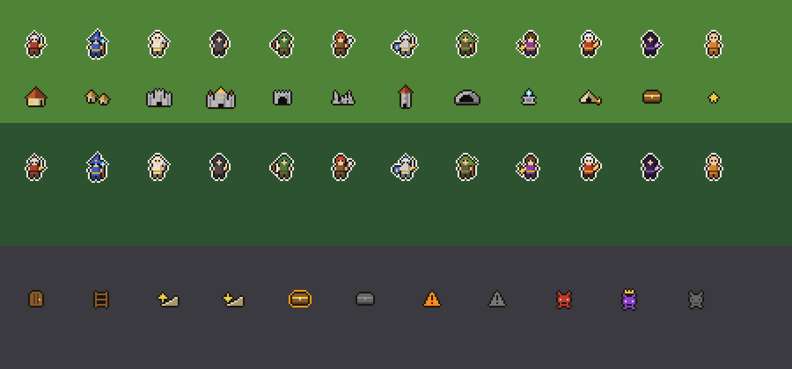

| Overworld | Interior |
| --- | --- |
| 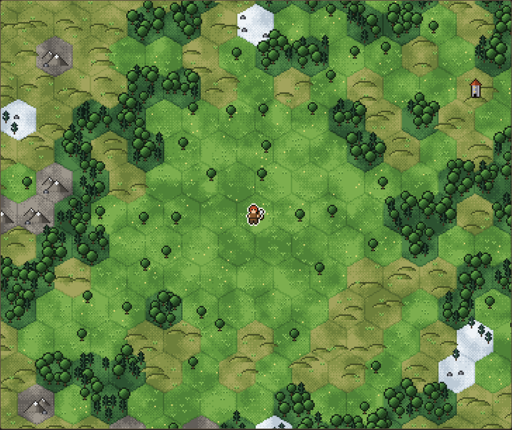 | 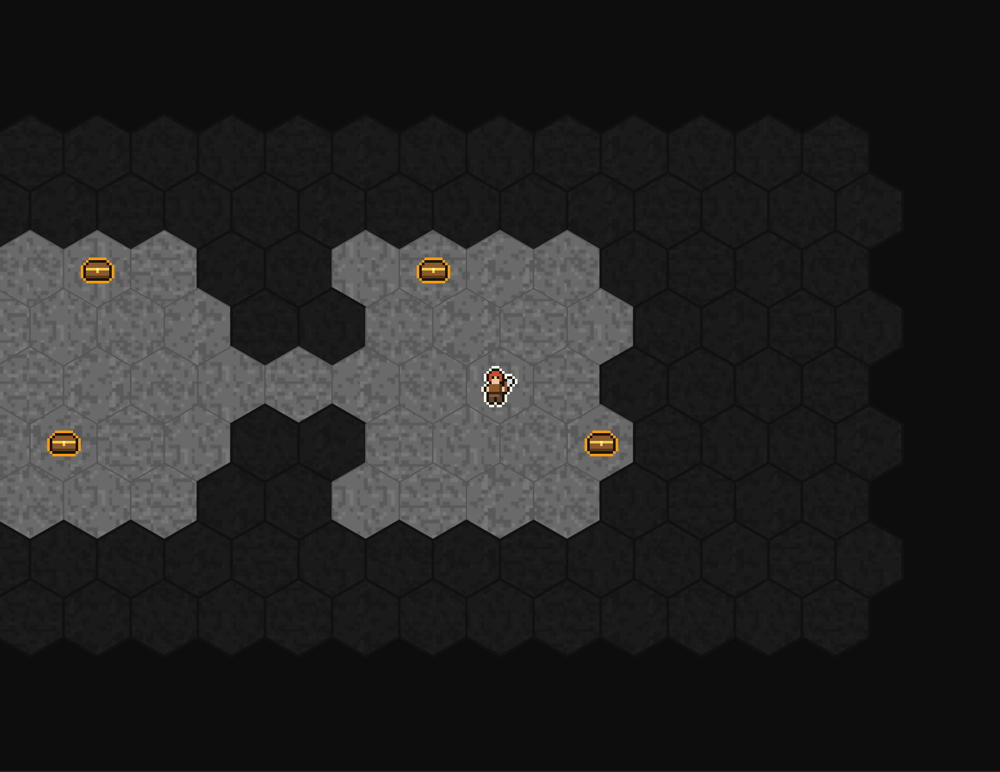 |

## 2026-09-25: Pixel art for interiors, combat and outlines

**What:** everything left on the old look now uses the pixel style.
- **Interior floors:** `utils/pixelInteriorRenderer.ts` ports the preview's interior
  renderer. It has five themes picked from the map's `poiType`: dungeon, cave, ruins,
  tower and town (camp/village/town). The 3/4 wall faces, building roofs and facades, and
  the torch and mushroom lighting are included. Each floor renders once into a single canvas.
- **Combat:** `utils/pixelBattlefieldRenderer.ts` bakes each battlefield into one canvas.
  Overworld-terrain fights get pixel ground tiles. POI fights (dungeon, cave, ruins, ...)
  get the matching interior theme, and their wall obstacles become real walls with faces.
  Trees, boulders, reeds, ice and dunes are sprites. Difficult terrain is a yellow dither.
  The centre landmark is the old vector art rasterised at art resolution with hard alpha.
  Allies are drawn with their class sprite and enemies with the monster sprite, plus a
  pixel ring under whoever's turn it is and a chunky HP bar.
- **Outlines and overlays:** selection, hover and attack outlines, plus the
  movement-range fill, now follow each hex's stepped art-pixel edge (`hexRenderer`).
  Overworld fog is drawn the same way, so it meets explored ground with no seam.
- **Removed:** `HexTextureGenerator` has no callers left and is deleted, along with all
  the vector obstacle and class-icon drawing in `CombatCanvas` (about 550 lines).

**Why:** the user approved the icons and asked to convert everything that was still in
the old style.

**Route:**
- Interiors render a whole floor at once, not per hex. Wall faces depend on the tiles to
  the north and lights reach across tiles, so per-hex tiles would need neighbour-aware
  cache keys anyway.
- Combat on overworld terrain uses ground tiles only. The overworld's forest sprites on
  every hex would bury the tokens. River fights use grass ground, because all-river hexes
  would turn into a maze of channels.
- Battlefield keys arrive as display names (`Forest`), so they're lowercased. Anything
  that isn't a POI type falls back to overworld terrain. The first pass routed `Forest`
  to the dungeon theme.
- The first obstacle pass was too small to read as blocked, so the sprites were doubled.
- `ART_PX` moved into `hexRenderer` so the outline code can use it without a circular import.

| Interior | Combat |
| --- | --- |
| 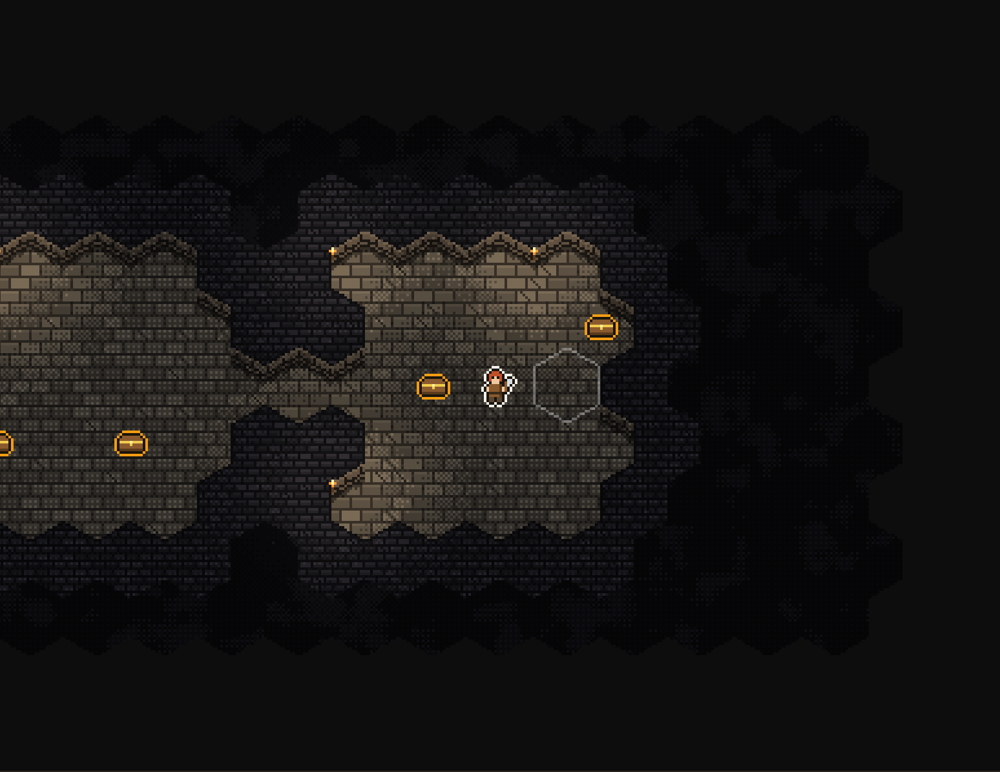 | 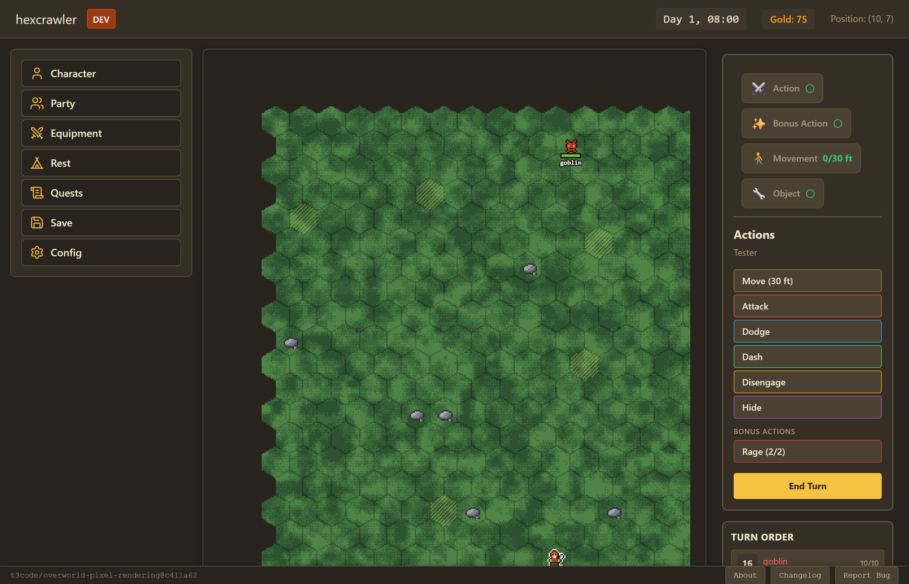 |

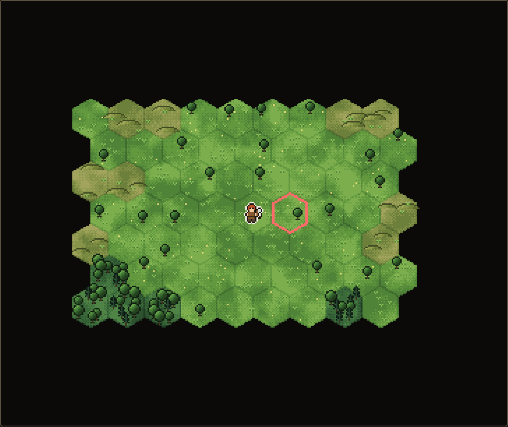

Battlefields shown at 1 CSS px per art px (dungeon, cave, ruins, town, desert, swamp):

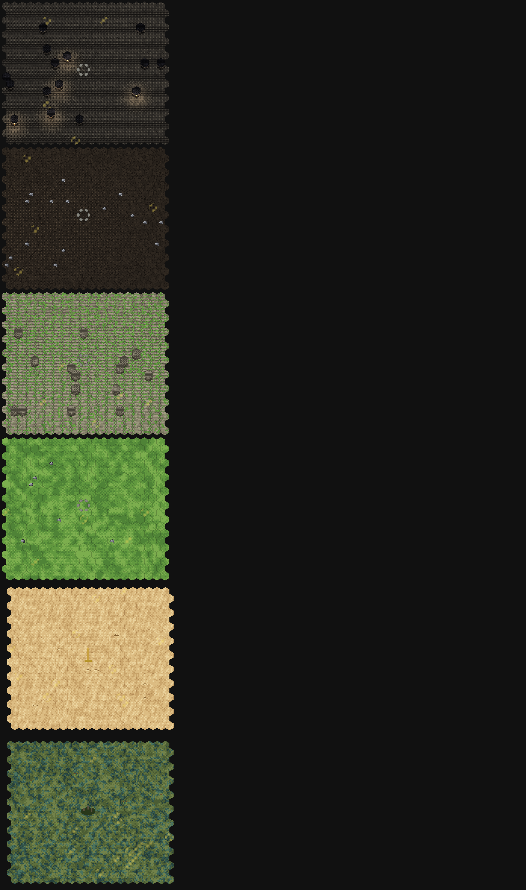

## 2026-09-25: Pixel icons in the HTML UI

**What:** a `<PixelIcon name>` component (`components/ui/PixelIcon.tsx`) shows any
sprite from `utils/pixelIcons` as a pixelated ``. `pixelIconImage` bakes the sprite to
a data URL. It gets 11 new UI sprites: action, bonus, move, object, lock, coins, gift,
bolt, disk, pin and bulb. They replace the emoji in:
- the combat action-economy bar
- the opportunity-attack prompt
- the exploration "Find the Exit Hex" lock
- the treasure-chest heading
- quest rewards
- save slot titles and locations
- the save-version tip

**Why:** the user pointed out that the Action / Bonus Action / Movement tracker was
still emoji next to the pixel-art map.

**Route:** the UI reuses the canvas sprite pipeline (ASCII art, auto outline, one bake
per sprite) instead of separate image files, so HTML and canvas icons look identical.
Typographic marks (✓ ○ ⚠ ✕ ♂/♀) and the dev-only DevTools panel keep their characters.

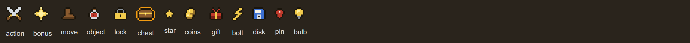

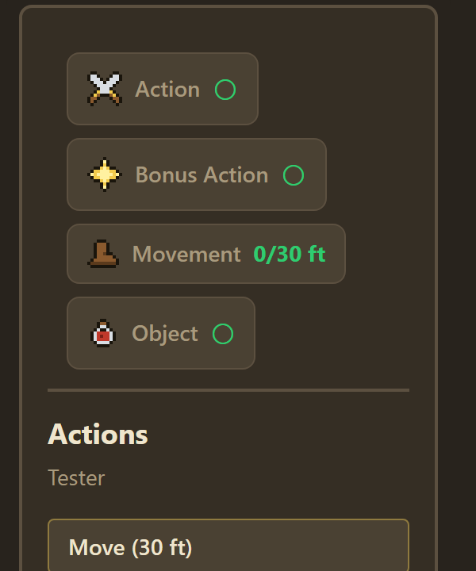

## 2026-09-25: Every remaining symbol is a pixel sprite

**What:** all the remaining icon glyphs in the UI are now `<PixelIcon>` sprites, using
new art added to `pixelIcons`:
- the overworld sidebar menu, which used lucide icons: character, party, equipment,
  tent, forage, scroll, disk, gear
- the character-creation class picker, which now shows each class's actual player
  sprite. `ClassIcon.tsx` and its SVGs are deleted.
- every close button (✕ ×) and the shadcn dialog's X
- ✓ checks, the ○ "available" dot, ⚠ warnings, ← exit/leave buttons, ▼▲▶ toggles,
  ♂/♀ in the party list and ⏱️ playtime
- the ■ legend chips in the town, now bordered CSS swatches
- the DevTools emoji

`lucide-react` had no users left and is uninstalled. The log hints that quoted
"← Exit ..." now just say "Exit ...", matching the buttons.

**Why:** the user asked for all symbols and emoji to be sprites after the combat bar.

**Route:** punctuation inside prose stays as text: • separators, × in "10×10", ≤, and →
in log messages. It reads as typography, not icons. Prettier reformatted all of
`ErrorBoundary` and most of `DevTools`, so those two were re-applied by hand to keep the
diff to the icon changes. The sidebar sprites were bumped to 3x after they looked tiny
next to the 22px lucide icons they replaced.

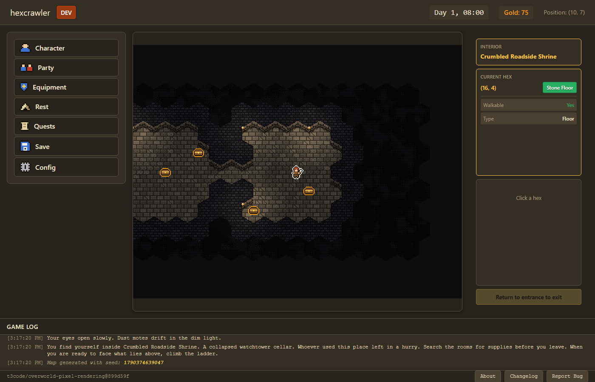

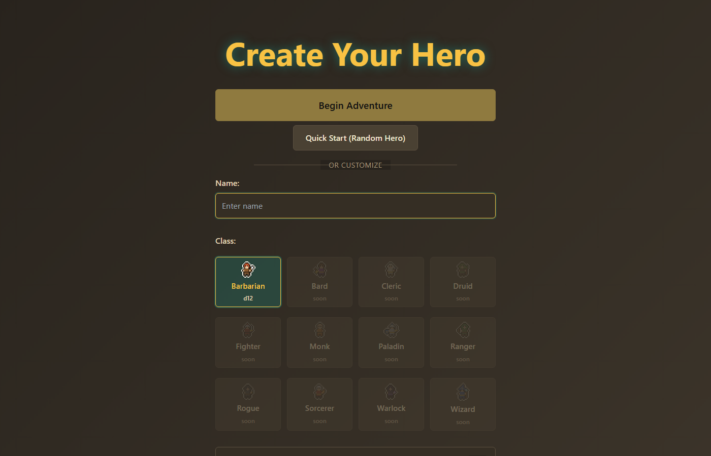

## 2026-09-25: Auto-merge PRs when CI passes

**What:** Added an `auto-merge` job to `.github/workflows/qa-tests.yml`. On a
same-repo PR it merges with a merge commit and deletes the branch, but only after
`checks` (typecheck, lint, unit) and both `qa-tests` browsers succeed.

**Why:** For now, a green CI run is enough review to land a PR.

**Route:** The test workflow already existed, so this is one new job, not a new
workflow. It depends on `checks` and `qa-tests` directly rather than on
`qa-summary`, because `qa-summary` runs with `if: always()` and reports success
when `qa-tests` is skipped. Merging directly in the job avoids needing GitHub's
repo-level auto-merge setting. Fork PRs are skipped because their token is read-only.

## 2026-09-25: Town redesign + milestone-1 review

**What:** Settlements are rebuilt from the grid up.
- `TownGenerator` is rewritten street-first. A two-hex avenue runs north from a two-hex gate.
  East–west streets cross it every 4 rows (street, 2 building rows, 1 yard row). The street
  nearest the middle gets a plaza with a well (a campfire in camps) and the quest board.
  Buildings sit in lots on the north side of each street with 1-hex alleys between them, so
  neighbours never merge. Each has a walkable doorstep on the street below its door.
- Landmarks (inn, shop, temple, blacksmith, market, barracks) are carved first from the frontage
  nearest the plaza, so they always exist. Houses fill what's left. Buildings get seeded names
  ("The Gilded Tankard").
- Map heights are now 4n + 2 per size (`SETTLEMENT_DIMENSIONS`) so streets fill the map.
- The renderer draws each building as one rectangle inscribed in its footprint. It has a gabled
  roof, a timbered or stone facade, windows, and a door above the doorstep. Per-type details: inn
  sign and lit windows, shop awning, forge glow and chimney, temple spire, barracks banners,
  market stall, wagon wheels, tents. The well, quest board and campfire are sprites. Fences are
  connected split rails, and cities get stone walls. City and metropolis no longer fall through
  to the dark dungeon theme.
- Gameplay fixes:
  - The gate exits every settlement type, not only `town`.
  - The inn option shows in any settlement.
  - Every settlement gets an Enter button (camps had none).
  - Every doorstep responds with a line naming the building.
  - The player spawns inside the gate instead of on it.
- Dead `TownScene` is removed. The settlement type list lives in one place (`isSettlement`).
- `docs/design/MILESTONE_1_REVIEW.md` is a top-down review of what blocks the first win
  condition: a quest from the first board to kill a level-5 boss.

**Why:** The user said towns "seem odd" and asked for a bottom-up redesign, plus a review against
the level-5-boss milestone.

**Route:** Rendered every settlement size through the live generator and renderer first (below).
The oddness came from the old approach:
- Rectangles in offset coordinates became ragged hex blobs.
- The door tile was cut out of the footprint, leaving a notch.
- Same-type neighbours merged into one roof, and houses sat on roads.
- Vertical roads zigzagged, the side fences were disconnected stubs, and the "secondary roads"
  mostly didn't connect.

Tried keeping per-hex roofs and just cleaning up placement. Rejected, because a hex-union roof
always reads as a blob. Drawing one inscribed rectangle per building, with a separate doorstep,
fixed the shapes outright.

South-facing doors only: the 3/4 view shows south faces, so buildings sit north of their street.

The first pass kept only the middle streets. That left the southern third as empty lawn and gave
the temple (4 wide) no lot. Switched to using every street, and to carving landmarks before
splitting house lots. A unit test checks for all sizes × 8 seeds that the entrance can reach
every door and the gate, and that the landmarks exist.

Before:

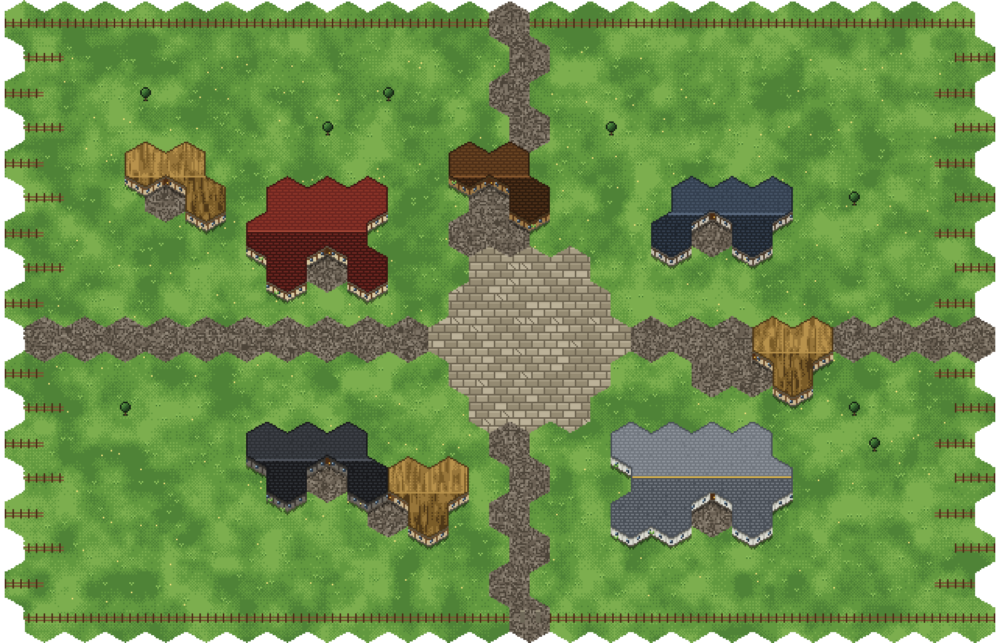
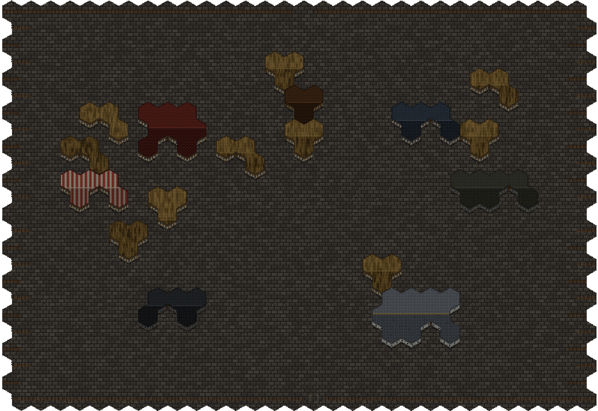

After:

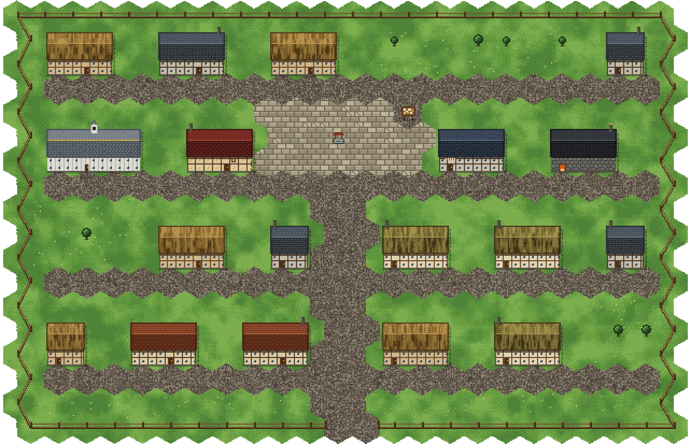
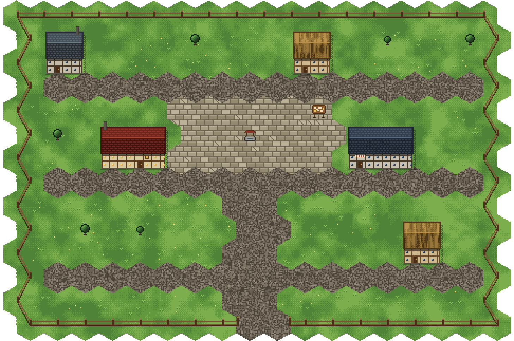
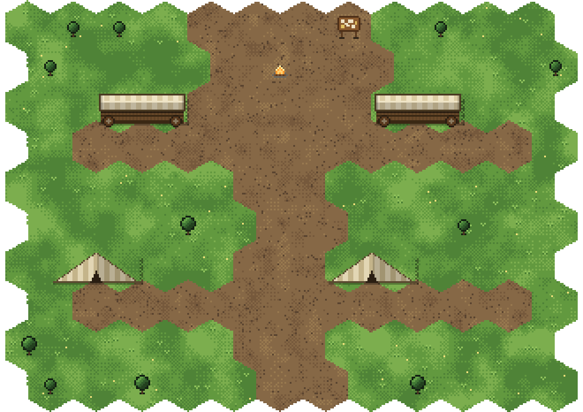
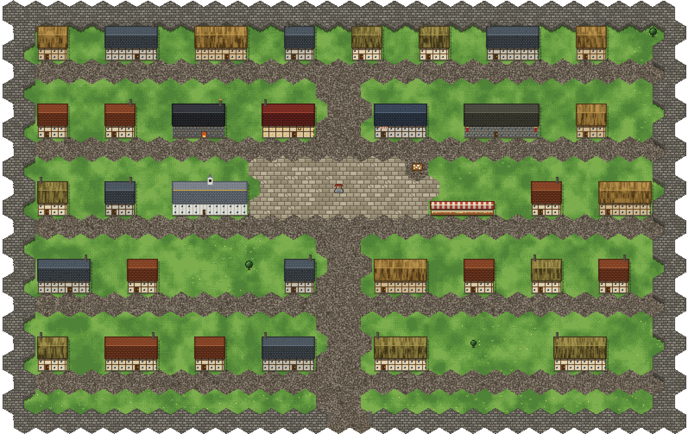
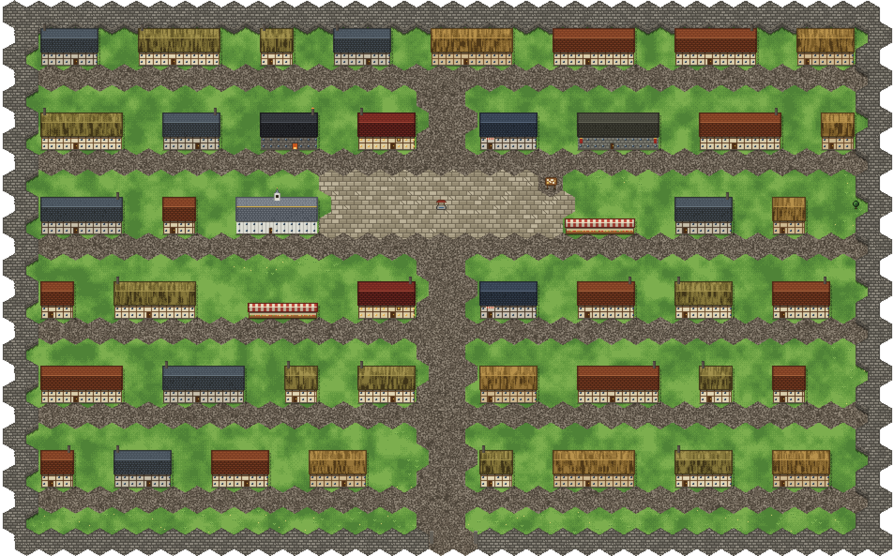

In game, the inn doorstep opening the rest panel with the inn option:

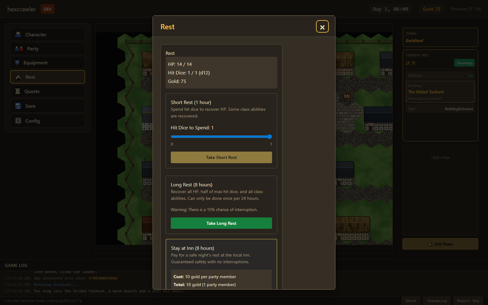

## 2026-09-25: Fix Rage to match the SRD 5.2

**What:** An audit of Barbarian Rage against the SRD 5.2 found four bugs:

- Rage carried `duration: 1`, so `tickStatusEffects` removed it at the start of the
  rager's next turn, even when it had been extended. Rage no longer has a
  `duration`. `tickRage` is the only thing that ends it.
- Only a hit kept Rage going. Any attack roll against an enemy now does, hit or miss.
- The cap was 10 rounds, the 2014 one-minute rule. It's now 10 minutes (100 rounds).
- Rage uses stayed at 2 forever. `levelUp()` now follows the table (2/3/4/5/6 at
  levels 1/3/6/12/17), and each new use is available right away.

Rage expiry also moved from the start of the rager's next turn to the end of their
current turn. `ADVANCE_COMBAT_TURN` ticks Rage on the outgoing combatant, so an
unextended Rage no longer halves enemy damage for an extra round.

**Why:** The user asked for Rage to be checked against the SRD, then for all the
findings to be fixed.

**Route:** The duration bug turned up while tracing the tick order for the timing
fix. It wasn't in the first audit. `tickRage` kept its counting logic and was
re-pointed at the end of the turn, rather than rewritten. Unit tests now drive a
real `Combat` through the reducer, so tick-order bugs like this one get caught.
Some items were left out because the game has no support for them yet: ending
Rage on Incapacitated or on donning heavy armor mid-combat, extending it by forcing
a save, and wiring STR-save advantage into actual saves.

## 2026-09-25: Pixel-art title screen

**What:** the title screen now sits on a full-screen `TitleBackground` canvas. It pans
slowly across a fixed-seed overworld, then crossfades through a metropolis, a dungeon,
a cave, ruins and a tower floor, and loops. The menu is a dark panel with a stepped
pixel frame over a vignette. The logo's soft glow is now a hard pixel drop shadow.

**Why:** the user wanted the title screen to match the new pixel theme, with a
scrolling hex background moving from the overworld into dungeons, caves and cities.

**Route:** there is no new art. Each scene is real generator output (`TerrainGenerator`,
`TownGenerator`, `DungeonGenerator`, and so on) drawn by the in-game
`PixelTerrainRenderer` / `renderInteriorFloor`, and POI icons come from `drawPixelIcon`.
Every map is baked once into a world-scale canvas, so each frame is just one or two
`drawImage` calls. All seeds are fixed, so the backdrop looks the same on every visit.
Only the overworld is built before first paint (about 1s). Each later scene is built
0.5s into the scene before it, which costs one 80-180ms hitch on the main thread per
scene. A worker would remove that, but the renderers need `document`, so it isn't worth
it yet. With `prefers-reduced-motion` set, you get a single still frame of the
overworld.

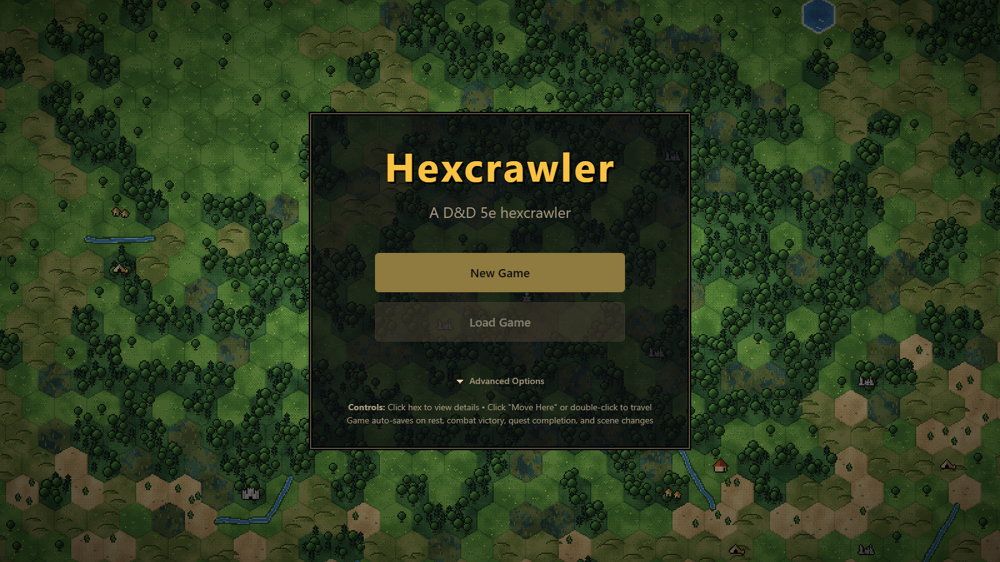

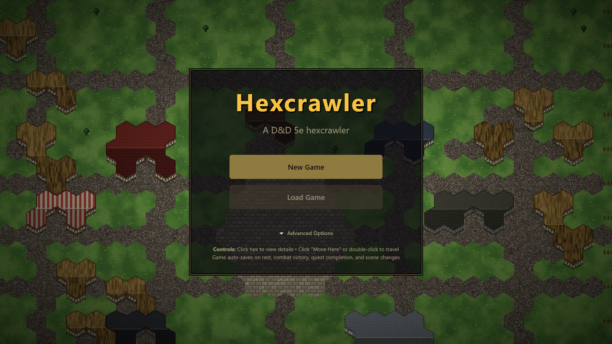

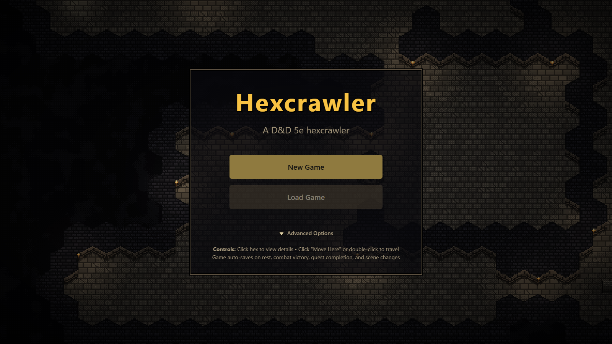

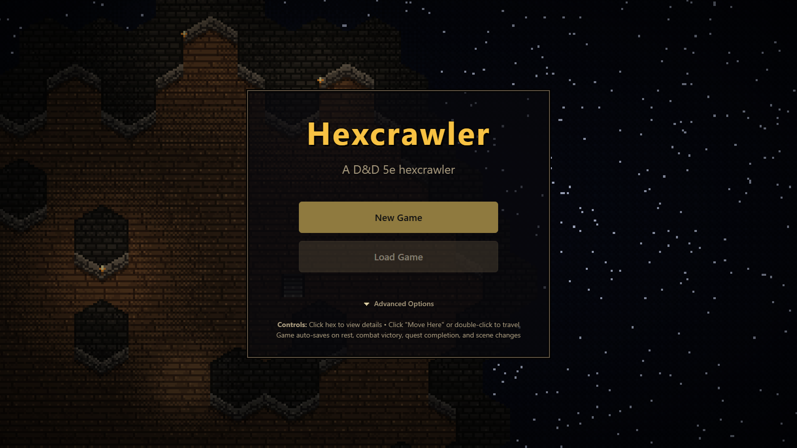

## 2026-09-26: RNG overhaul (ADOM-style fresh gameplay rolls)

**What:** all randomness now goes through `utils/seededRandom`, and there are two kinds of it.
World generation stays seeded: a string seed goes through the cyrb128 hash into sfc32 (128-bit
state; this replaces the 31-multiplier string hash and mulberry32). Gameplay rolls use one sfc32
stream seeded from `crypto.getRandomValues`. All 45 `Math.random()` calls (combat, AI, shops,
rest, loot, time costs) moved onto it.

Deleted:

- the NPC generator's toy LCG, which could only produce 233,280 different sequences;
- the `Math.sin` generators in `RegionGenerator`, `WeatherSystem` and `PerlinNoise`, now
  `hashToUnit(seed, n)`, which is stateless so `WeatherSystem` still saves as one counter;
- the unused `SimpleNoise`;
- the copy-pasted mulberry32 in `pixelTerrainRenderer`.

Encounter and hazard rolls in `ExplorationScene` are no longer seeded by hex. NPC seeds and a
blank world seed now default to `randomSeed()` instead of `Date.now()`.

**Why:** the user asked for the RNG to be "far far more random", taking ADOM as the model. In
ADOM the world comes from a seed, but gameplay rolls draw on fresh entropy. Reloading changes
the outcome (players save-scum wishes that way), and Biskup chose not to block it. We were doing
the opposite: a hazard's saving throw came from `mapSeed-hazard-col-row`, so the same hex always
gave the same roll, and reloading replayed it.

**Route:** `Math.random` itself was never the problem (V8's xorshift128+ is statistically
fine). What made it feel un-random was the rolls seeded by hex, the weak generators and the
hash that left similar seeds almost equal (`…-1-10` vs `…-10-1` hashed 2,760 apart). I
considered mixing in keystroke timing the ADOM way and rejected it: `crypto.getRandomValues`
already gives OS entropy for free. We kept one fast seeded stream rather than calling crypto
for every roll, so tests can still mock `DiceRoller`.

Trade-off, agreed with the user: the same seed text now builds a different world. Saves store
the generated map, so they still load, but land that gets generated beyond an old save's map
edge will not line up with it. `SAVE.VERSION` was left alone so old saves aren't rejected.

## 2026-09-26: Overworld as an adventurer's journal

**What:** the overworld (including interiors and combat) is now laid out as an open book.
The left page has a kicker with the day and time of day, a location title (the POI or
terrain, or "Battle is joined!"), the map in a double-ruled frame, and a strip for gold,
rations, time and position. The right page is a codex: the hero's portrait, HP and AC,
then the context pane (hex details, interior info, or combat actions), then the game log
written as diary entries in italic serif. The old left menu is gone. The menus are now
bookmark tabs on the book's edge and still open the existing panels.

A new `journal` parchment theme is the default. The book always uses it, since its variables
are also set on `.journal-layout`. Picking it in Settings extends it to modals and the other
scenes. Players with a saved theme keep that theme for modals.

Small fixes that came along: `SaveSlot.css` had a global `.character-name { color: #fff }`
that turned the name in the Character panel white. It's now scoped to `.save-slot`. Log roll
numbers read `--log-roll`, so they stay legible on parchment. `MenuSidebar` had no
callers left, so it was deleted. The QA driver's gold/rations selectors accept the new "75 gold"
wording.

**Why:** the user asked for a reimagining of the UI layouts that kept only the pixel icons,
and then picked the journal direction out of five mockups to try on a PR.

**Route:** the five directions were built first as a static page, `docs/ui-mockups/index.html`
(served by Vite at `/docs/ui-mockups/index.html`). It uses the real `pixelIcons` sprites over a
map screenshot, with an explore/combat toggle for each direction. The rejected directions were a map-first
floating HUD, a monospace tactician's console, 16-bit JRPG command windows, and a
minimal glass dock. For the build, the existing theme variables did most of the work. Every
panel already reads `--panel-bg` / `--text-color` etc., so a parchment variable set
reskins HexDetails, the combat panel and modals without touching them. Only
OverworldScene's layout was restructured. Panel content stays in modals for now. The
Equipment panel is 1050px wide and wouldn't fit on a page.

The mockup we settled on, in explore and combat:

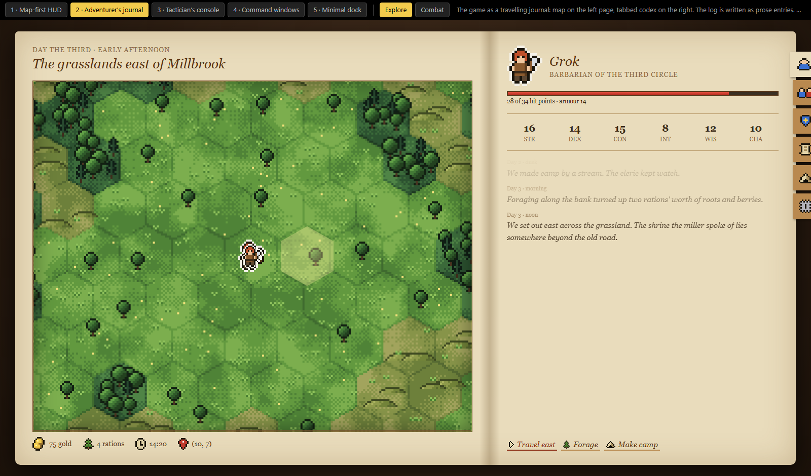

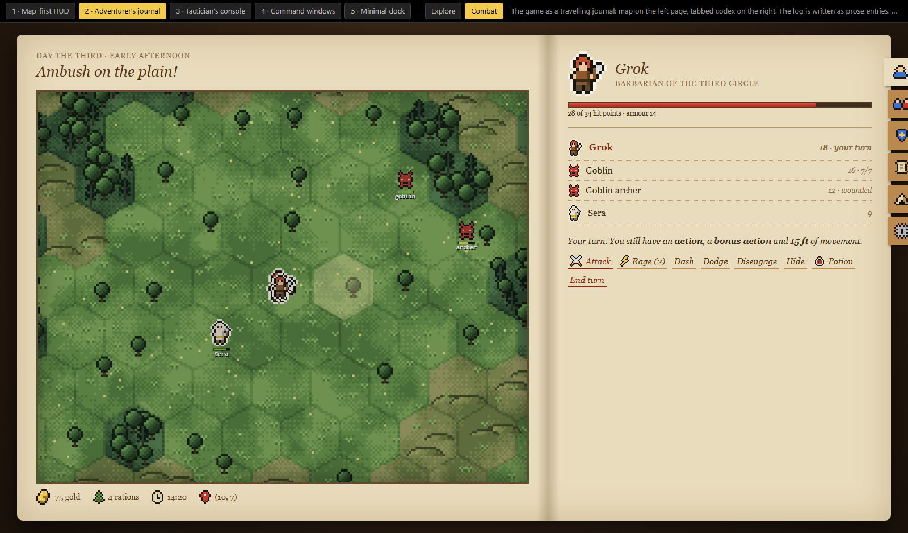

Two of the rejected directions:

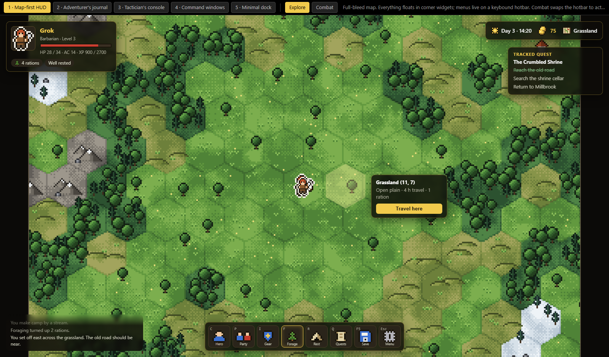

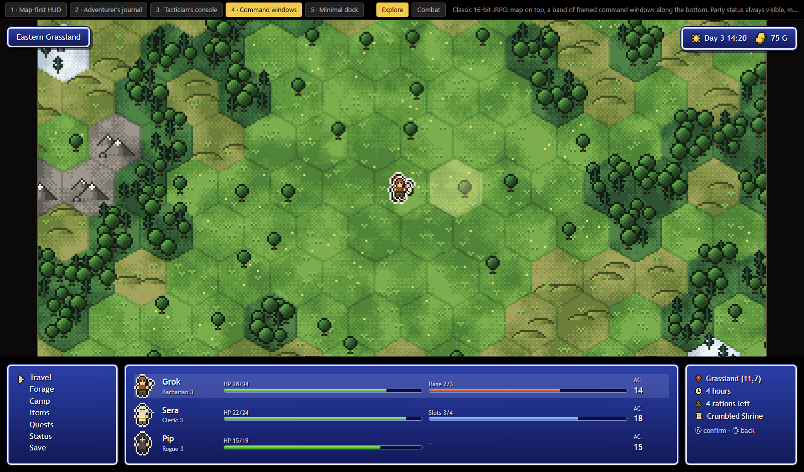

In game:

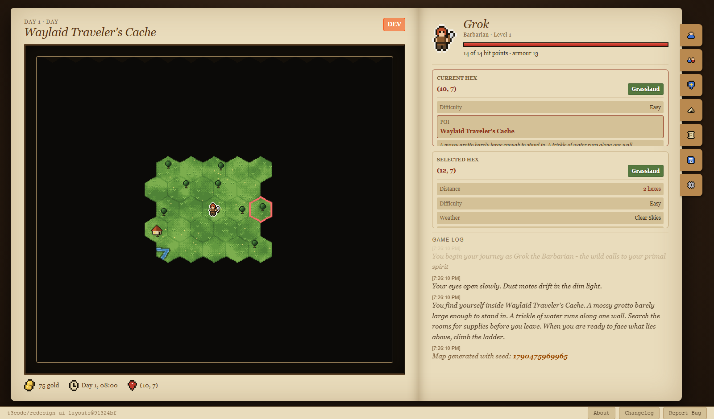

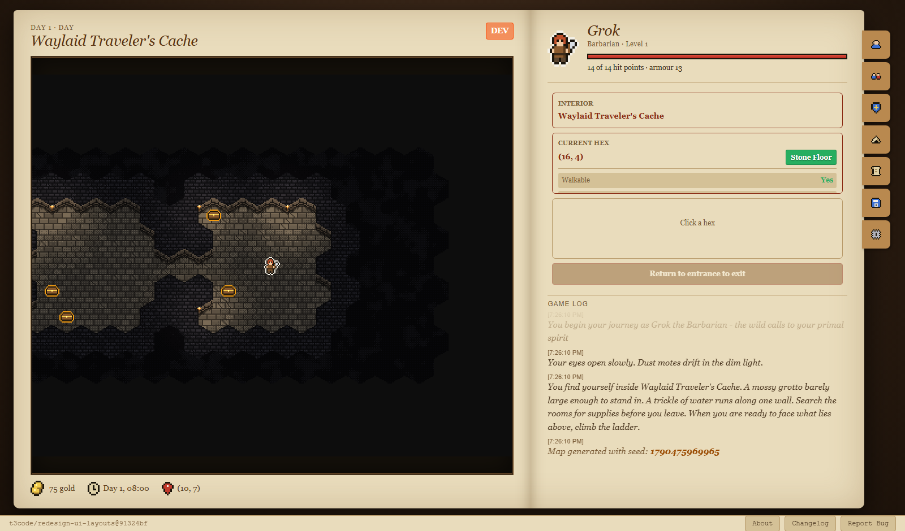

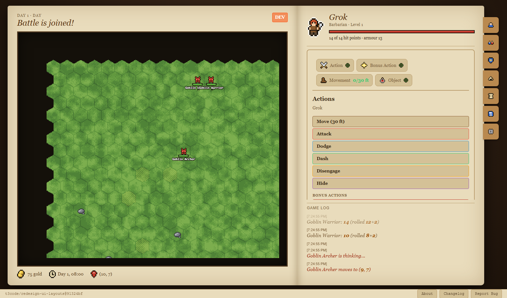

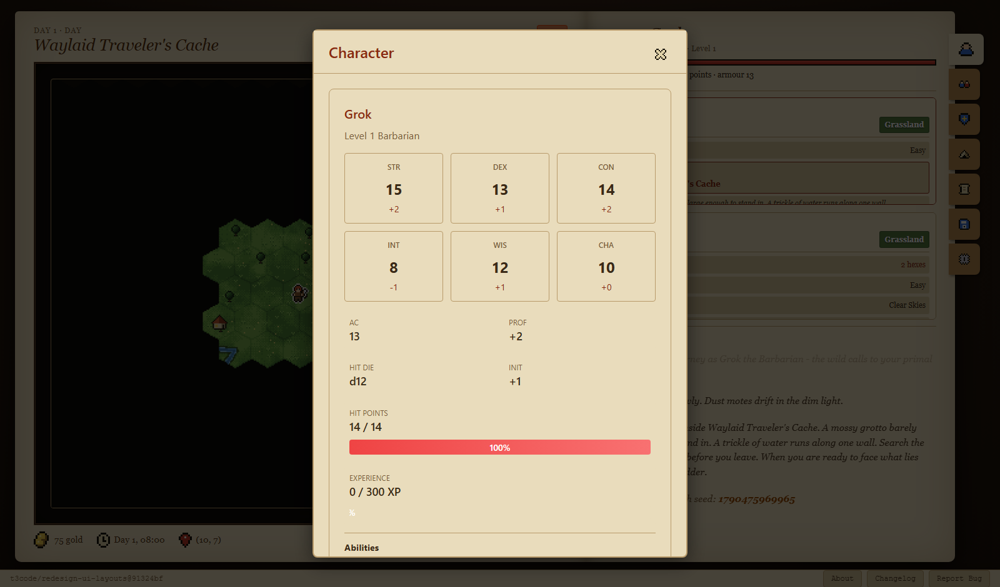

## 2026-09-26: Stop the journal tabs bouncing

**What:** the bookmark tabs no longer change width on hover or when open. Only their colour
changes.

**Why:** the user reported the tabs bouncing when hovered.

**Route:** hovering widened a tab from 50px to 56px. The tab column is pinned by its right
edge, so the extra width pushed the whole column left and out from under the cursor. The
hover then ended and the tab shrank, over and over. Colour-only feedback avoids the loop.
Measured in Playwright: the tab and the column keep the same bounding box when hovered.

## 2026-09-26: Keep completed quests saveable

**What:** `COMPLETE_QUEST` now stores the completed quest as a `Quest` instance with status
`completed` and a `completedAt` stamp. It used to store a `{ ...quest }` spread. A new
`questReducer` unit test covers this.

**Why:** the spread dropped the class methods. `SaveManager` calls `toJSON()` on every
completed quest, so once any quest was finished, every save failed with `q.toJSON is not a
function`, the autosave included. The agent redesigning the Quests page found it.

**Route:** the fix is in the reducer, not in SaveManager. Anything downstream (the quest
log's `getProgress()`, saving) can then rely on completed quests being real instances.
`Quest.fromJSON` is used because it accepts either an instance or a plain object. The new
test fails against the old reducer and passes against the fix. `FAIL_QUEST` has the same
spread, but failed quests aren't saved, so it's left alone.

## 2026-09-26: Journal tabs open pages, not pop-ups

**What:** the bookmark tabs now turn the whole right page into the chosen panel. A new
**Journal** tab (map icon) brings back the hero, context pane and log, as do Escape and a
"Back to the journal" link. A fight always opens on the journal page. Keyboard shortcuts that
used to open pop-ups (R, I, Q, and the inn/quest-giver interactions) now open the page.
`MenuPanel` is gone.

Every panel was redesigned for a ~520px parchment page. It uses a shared vocabulary of
`.jp-*` classes at the end of `style.css`: ruled section headings, dotted-leader key/value
rows, lists split by dotted rules, pixel HP/XP bars, and underlined ink links for actions in
place of filled buttons.

- **Character:** portrait header, six ability scores in a row, dotted-leader vitals, HP/XP
  bars, and features with "2 of 2 left".
- **Party:** the company as a selectable list (it still picks whose gear Equipment shows).
  With no companions it reads "You travel alone."
- **Equipment:** one column instead of three. "Worn & wielded" slot rows, then the pack with
  filter links. Item details open under the selected row, with Equip/Unequip links. Rarity
  colours are now ink tones; the old neon colours were meant for dark themes.
- **Rest:** prose, HP and hit-dice rows, then a short rest, a long rest and the inn as
  separate sections. The inn button now contains "Rest (10g)", which the QA driver expects.
- **Quests:** filter links, an entries list, and each quest with an italic title, a
  checklist of objectives, and rewards as rows.
- **Save:** slots as bookmarks. `SaveSlotManager` has a new `embedded` prop that drops its
  Radix `DialogTitle` on the page, where it crashed outside a dialog. The title-screen Load
  dialog keeps its accessible title.
- **Settings:** theme and controls as labelled fields, and the keybindings as dotted rows
  ending in small key caps.

Fixes that came along: `RestMenu` passed the character from state straight to
`RestManager`/`applyStarvation`, which change it in place. It now hands them clones, as
CLAUDE.md requires. The quest log no longer crashes on completed quests and no longer shows
a Complete button on them. About 110 CSS rules for the old panels, sidebar and modal were
removed after checking that nothing in `src` references their classes.

**Why:** the user asked for the tabs to change the whole right pane and for the panels to be
redesigned in the journal style.

**Route:** the lead set up the page switching and the `.jp-*` classes first. Four parallel
agents then redesigned Character+Party, Equipment, Rest+Settings and Quests+Save against
the same brief, each with its own `<Component>.css`. A shared Playwright helper started a
fresh game and screenshotted each tab, and each agent loaded test data (items, quests, low
HP, a town) through the React fiber to review the populated states. Panel content couldn't
stay in modals, because the old Equipment modal was 1050px wide.

Before (Equipment squeezed onto the page) and after:

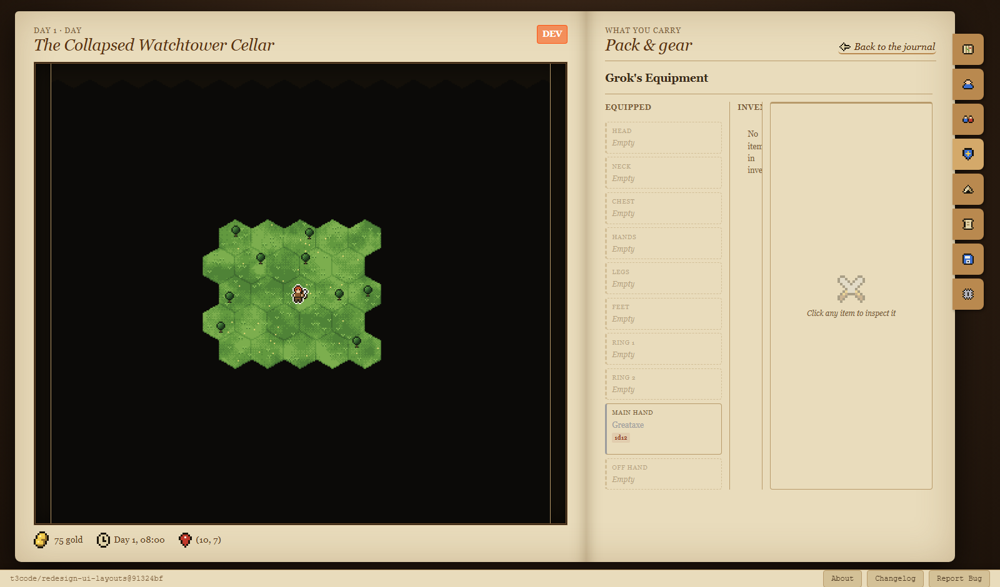

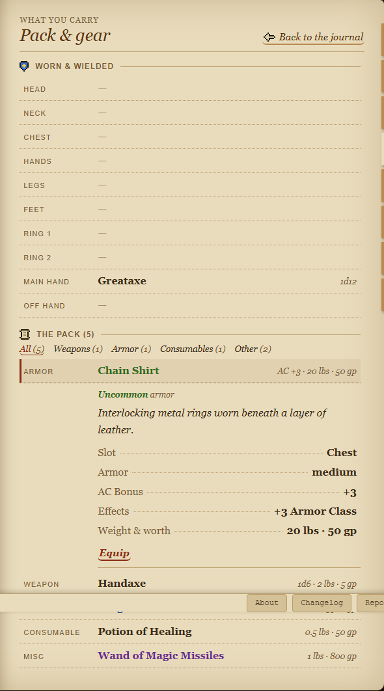

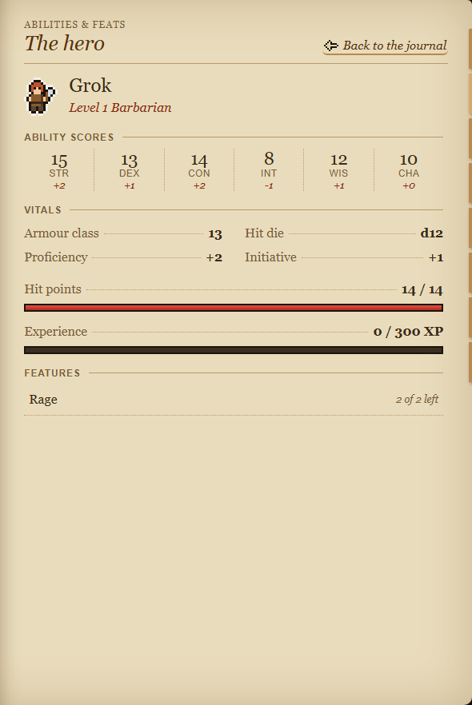

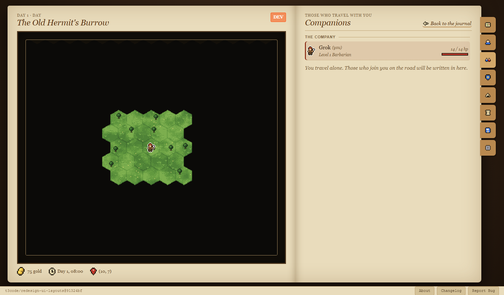

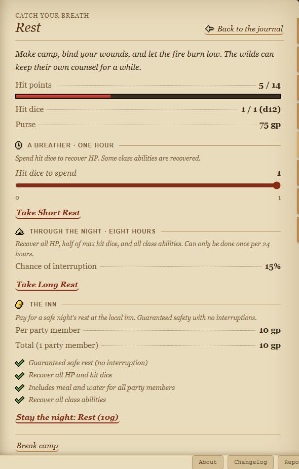

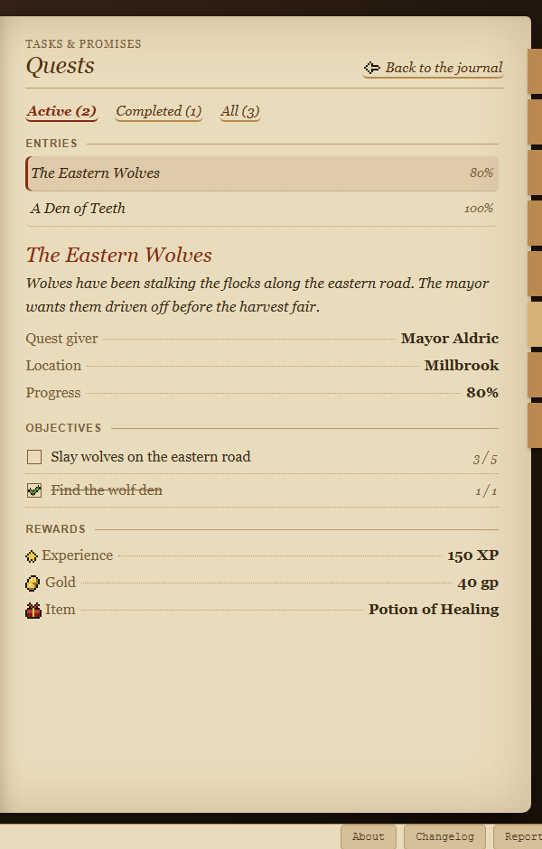

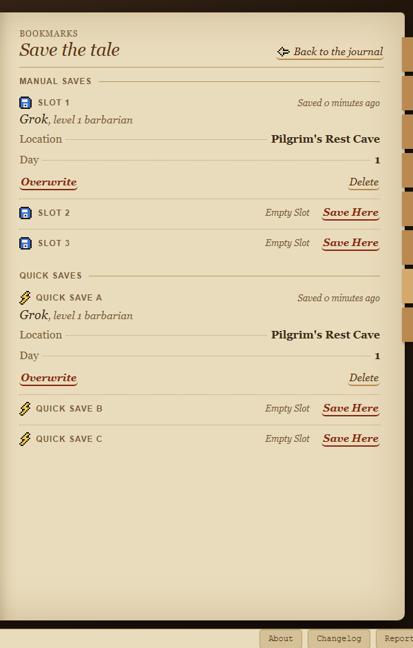

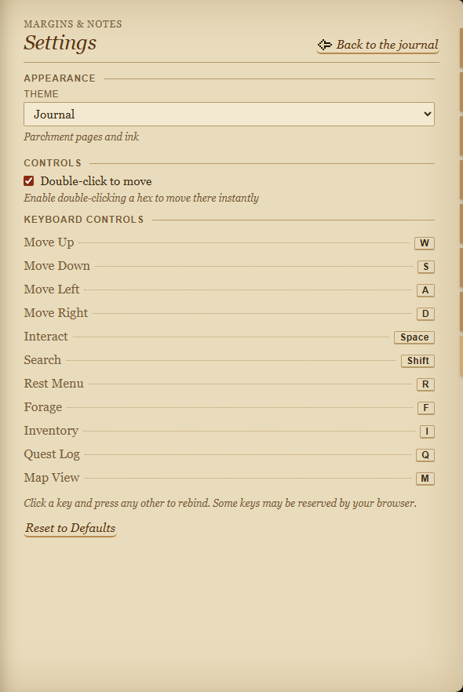

The shared save list in the title-screen Load dialog:

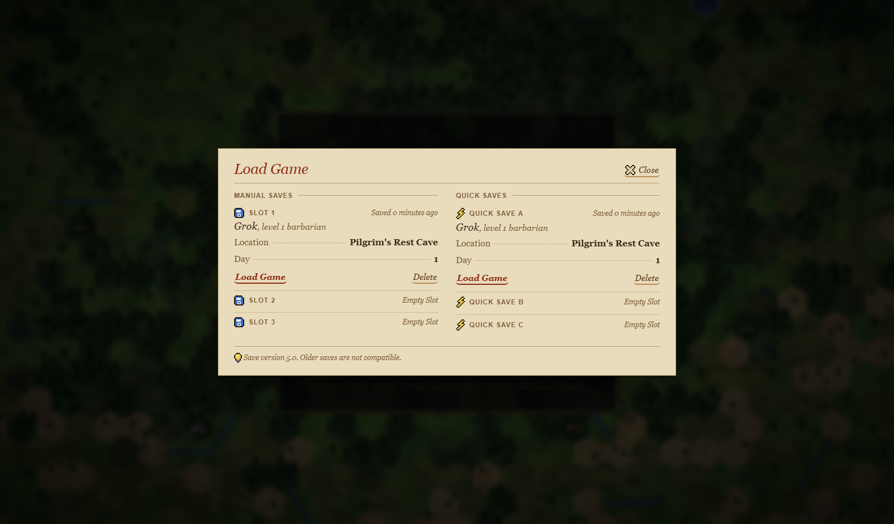

## 2026-09-26: Combat actions in the journal style

**What:** the combat Actions and Bonus actions section is rewritten for the parchment page.
- It opens with "**Grok**, it is your turn."
- A tally line lists Action, Bonus and Object; each is struck through in oxblood once spent.
  Movement shows "30 of 30 ft" with a small green bar.
- While raging, a note with an oxblood rule replaces the red "RAGING" gradient banner.
- Actions are ruled rows: a pixel icon, the name, and a short gloss of what the action does
  ("double your movement", "leave reach safely"). Spent actions are faded and struck through.
- Bonus actions show their remaining uses as ink pips (●●○) instead of "(2/3)".
- **End Turn** is an ink link pinned to the bottom of the pane, so it stays reachable when
  the list scrolls. It used to be a filled gold button.

Logic, props and the button names are unchanged: the unit tests, and the QA driver's
`text=Attack` / `text=End Turn`, still find them. The ActionPanel test now mocks
`PixelIcon`, because jsdom has no canvas to bake the sprites on.

**Why:** the user asked for the actions/bonus actions section to fit the new aesthetic.
It was the last boxed, multicolour panel on the combat page.

**Route:** the rows reuse the shared `.jp-list` / `.jp-heading` / `.jp-bar` / `.jp-link`
classes, so `ActionPanel.css` only holds the tally, the rage note, the pips and the pinned
footer. The glosses avoid the word "attack", so the QA driver's case-insensitive
`text=Attack` can't match a gloss before the real button. The first version left End Turn at the
end of the list, and it scrolled out of view once the rage note appeared. Pinning it fixed
that. The turn-order list below is untouched.

Before ([journal layout](docs/devlog/2026-09-26-journal-layout/combat.png)) and after, on the
player's turn and after raging:

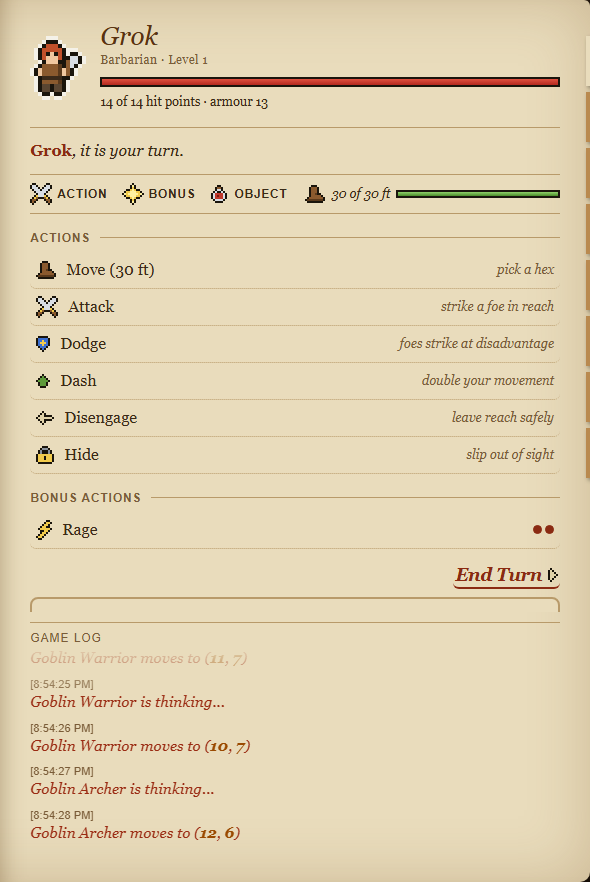

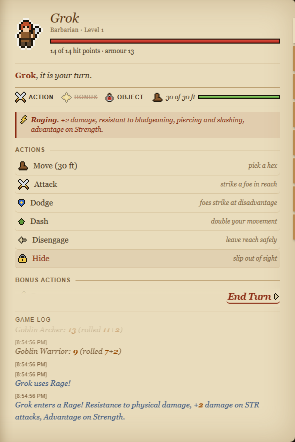

## 2026-09-26: Turn order in the journal style

**What:** the combat turn order is now a ruled list:
- Each row has the initiative in a small ink roundel, then the combatant's sprite: the class
  sprite for allies, the goblin sprite for foes, and the grey "defeated" sprite for the fallen.
- Foes are named in oxblood.
- The current combatant is highlighted and marked "acting".
- HP shows as "10 / 10" above a thin bar, which turns red at 30% or less.
- Fallen combatants are struck through and read "fallen" instead of "DEAD".

The enemy-turn box ("Enemy is taking their turn...", with a red heading) is now one line of
prose with an oxblood rule: "**Goblin Warrior** is taking their turn…". It has
`role="status"`, so screen readers announce it.

**Why:** the user said yes to restyling the turn order after the actions section. It was the
last boxed panel on the combat page.

**Route:** it reuses `.jp-list` / `.jp-heading` / `.jp-bar`, and the list is now an `<ol>`
with `aria-current` on the acting row. The multicolour HP bar (green, amber, red) became
green, then red when low, the same as the Party page.

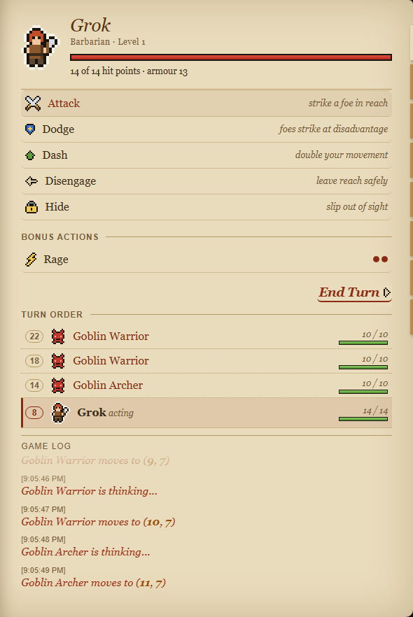

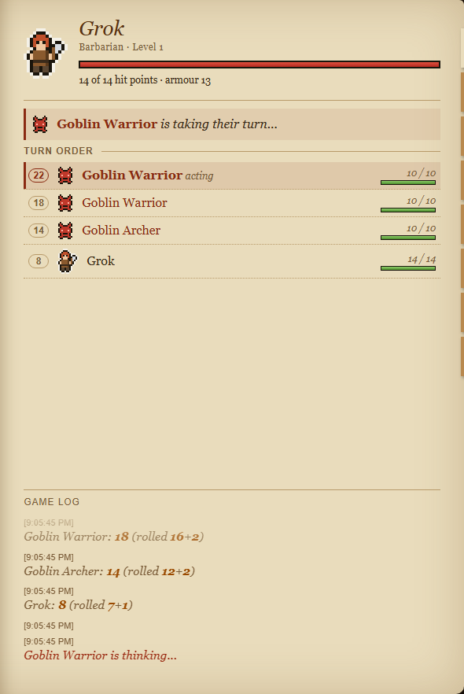

## 2026-09-26: Hex details move into the game log

**What:** the Current Hex and Selected Hex panels are gone from the journal page, in the
overworld and inside POIs alike.
- **The log instead:** every overworld step now logs one arrival line, e.g. "You arrive in
  Grassland (11, 7); the going is easy. Clear Skies." It also names a place you already know
  is there ("Millbrook is here."). The time-of-day, weather and terrain flavour text are
  appended to that same entry, not logged separately.
- **The actions that lived in the Current Hex panel** are now a slim `HexActions` line,
  shown only when you stand on a known place. It reads "Crumbled Roadside Shrine is here."
  with ink links for Enter / Interact / Search / Explore / Pray / Offer (10g).
- **Inside a POI**, `InteriorActions` keeps only the way out: an "Exit Interior" / "Exit
  Town" link, or "Return to the entrance to leave." Interior arrivals were already logged
  (buildings, stairs, loot, the entrance).
- **Layout:** outside combat the context area shrinks to fit its contents and disappears
  when empty, so the log gets the rest of the page.

**Why:** the user wanted the selected/current hex panels removed, with that information
written to the game log on arrival instead.

**Route:** `describeArrival` / `describeGoing` are pure helpers in `flavorTextGenerator`,
covered by a unit test. The difficulty wording ("easy", "moderate", ...) comes from the old
HexDetails. A newly discovered place isn't repeated in the arrival line, because it gets its
own "You discovered…" entry. Clicking a hex still highlights it on the map but no longer
opens a panel. Movement was already by double-click or keyboard; the old "Move Here" button
had been gone since before this work. Dropped: the selected hex's distance readout and the
interior encounter card (CR, creatures).

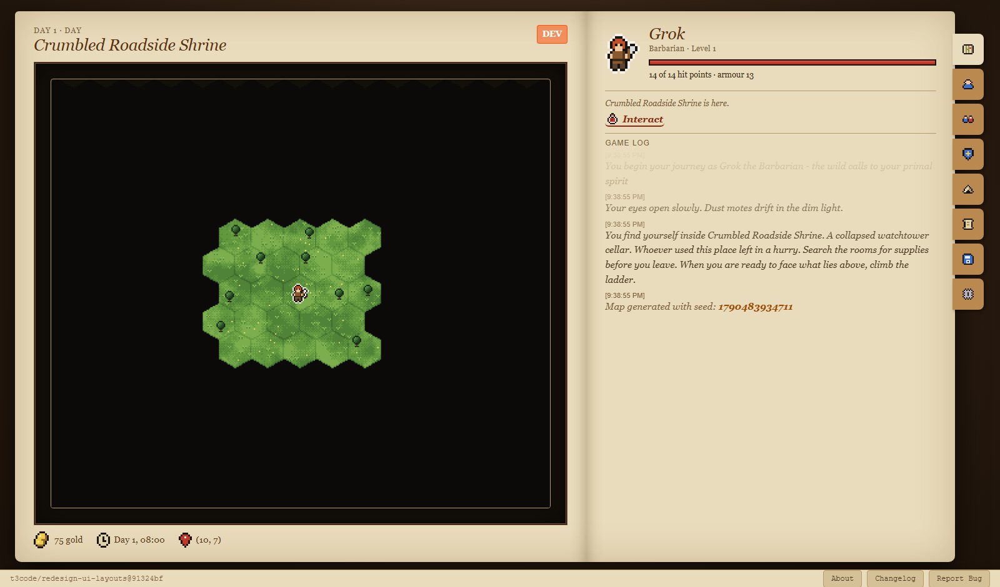

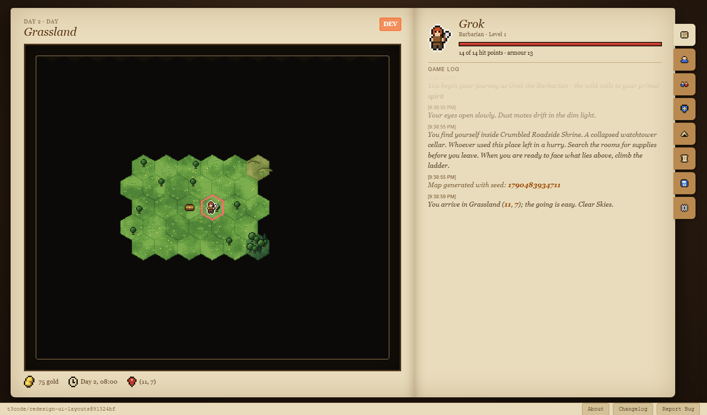

## 2026-09-26: Bug sweep (issues #6–#12 plus eight more)

**What:** one pass fixing every open issue and the bugs a follow-up audit turned up.
- **Combat:**
  - A second fight could soft-lock on an enemy turn. The AI's "turn already processed" key (`round:index`) survived between fights, so a repeat key skipped that enemy with no fallback armed.
  - HP, spell slots and Rage uses from a won fight now carry back to the character (#6). A player downed in a fight the party still won comes back at 1 HP.
  - Enemies use their Multiattack (#7).
  - Enemies pick melee when adjacent and a ranged attack otherwise (#11). The SRD extractor keeps ranged attacks now, so the goblin has its shortbow, the scout its longbow and the hill giant its rocks.
- **Encounters:**
  - Won overworld POIs stay cleared. Walking back onto one used to restart the fight for full XP.
  - Interior encounters (dungeon, cave, tower, ruins) now start real combat (#9). The fight goes through the overworld engage path, and a won encounter stays defeated when the interior regenerates.
  - Tower and boss CR escalation is capped: one CR rung every two floors, bosses +2 rungs, down from ×1.5.
- **Character:**
  - Equipping an item used to delete what was in the slot and never applied item AC or stat bonuses. It now goes through `Character.equipItem`.
  - Level-up HP no longer vanishes on the next equip.
  - An Ability Score Improvement is granted at 4/8/12/16/19, plus Fighter 6/14 and Rogue 10 (#10).
  - `clone()` is a real deep copy.
- **State:**
  - `party.player` follows `playerCharacter` (#8).
  - `SEARCH_POI` actually records searches, so shrines and searches can't be repeated forever.
  - Starvation applies once per long rest.
  - `LOAD_GAME` starts from a fresh state, and failed quests are saved.
  - The shop can't pay out for an item you no longer have or sell the same item twice.
- **Permadeath:** saves are wiped the moment the party falls, not when "Return to Title" is clicked.
- **Display:** fractional CRs show as 1/8, 1/4, 1/2 (#12).
- **Dead code removed:** `ExplorationScene`, `useCombatHandler`, `useMovement`, `encounters.ts`, `EnemyMovement` and the `DEFEAT_ENCOUNTER` action.

**Why:** the user asked to investigate the open issues, look for others worth prioritising,
then fix all of it in one PR.

**Route:**
- **Party sync:** handled once in the root reducer (`syncPartyPlayer`) rather than in each of the six reducers that replace `playerCharacter`.
- **HP write-back:** clones the *current* `playerCharacter` and copies HP and resources onto it. It doesn't swap in the combat copy, because that would erase the XP from the `AWARD_XP` dispatched just before.
- **Remembering wins:** they're stored in the existing (previously unused) `explorationState.clearedEncounters`, which was already saved and loaded. Interiors aren't saved, so reapplying that set when a floor map is stored keeps won fights won.
- **Multiattack:** the AI dispatches one attack per swing, and the reducer ignores swings at a target that's already down. This was chosen over a multi-hit reducer action, so player and enemy attacks keep one code path.
- **ASI:** auto-applied: +2 to the highest base score, spilling over at 20. A picker UI is deferred (`ponytail:` note in `Character.ts`).
- **Interior creature text:** generated text like "CR 2 enemies" or "Boss: CR 3 …" is mapped to parseable creature strings. Bosses fight alone.
- **Checked in a real browser:** HP persisted across three forced goblin fights until the Barbarian died from attrition. Every enemy turn ran in back-to-back fights, including the key collision that used to soft-lock. The hill giant made 2 attacks per turn and threw rocks at range. Saves were gone on the game-over screen.
- **Not checked in a browser:** an interior encounter fight. The reducer side is unit-tested.
- **Known simplification:** Multiattack applies to any attack, so the hill giant throws two rocks where the SRD gives one.
